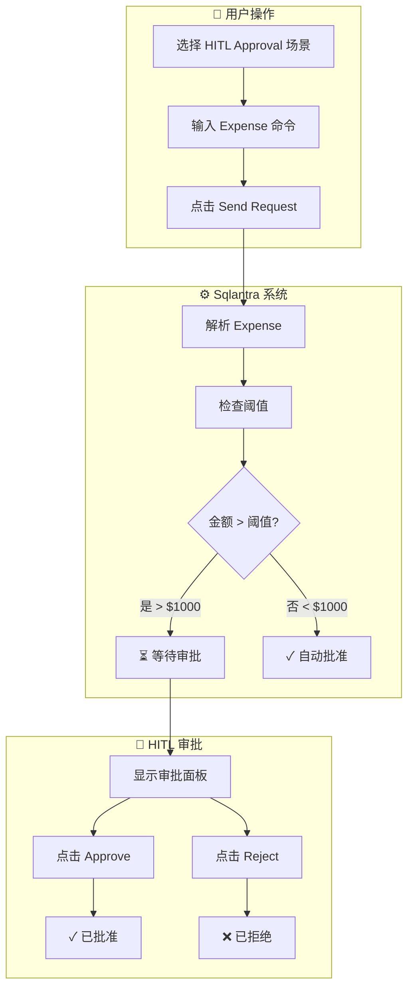
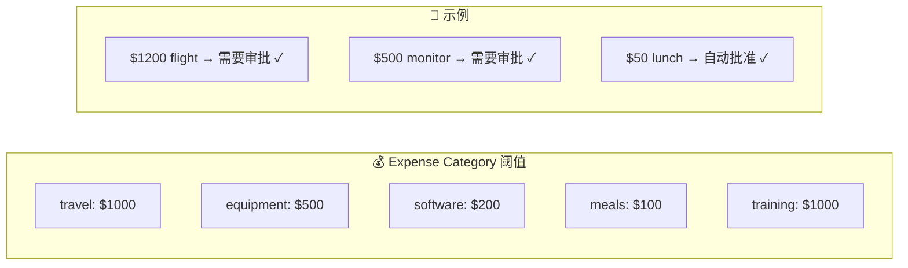

# HITL Expense Approval Workflow - 完整流程图

## 整体流程概览



---

## Step by Step 详细流程

### 场景：提交高额 Expense ($1200 travel)

```mermaid
sequenceDiagram
    participant U as 用户
    participant UI as Web界面
    participant Sqlantra as Sqlantra系统
    participant HITL as HITL审批
    participant DB as 数据库

    U->>UI: 选择 HITL Approval 场景
    UI->>U: 显示输入框预填内容<br/>"Submit expense: John Doe, travel, $1200..."

    U->>UI: 点击 Send Request
    UI->>Sqlantra: POST /api/query<br/>query: "Submit expense: John Doe, travel, $1200..."

    Note over Sqlantra: Step 0: Sqlantra Start
    Sqlantra->>Sqlantra: 解析 Expense 参数
    Note over Sqlantra: employee="John Doe"<br/>category="travel"<br/>amount=1200

    Note over Sqlantra: Step 1: Expense Validation
    Sqlantra->>Sqlantra: 验证类别和金额

    Note over Sqlantra: Step 2: Threshold Check
    Sqlantra->>Sqlantra: 查询 travel 阈值 = $1000<br/>$1200 > $1000 → 需要审批

    Note over Sqlantra: Step 3: HITL Approval Required
    Sqlantra->>DB: create_approval()<br/>status="pending"
    Sqlantra-->>UI: 返回 pending=true

    UI->>U: 显示审批请求卡片<br/>⚠️ Awaiting your approval
    
    Note over U: 用户可以选择：
end
```

---

## 流程1: 点击 Approve ✅

```mermaid
sequenceDiagram
    participant U as 用户
    participant UI as Web界面
    participant Sqlantra as Sqlantra系统
    participant HITL as HITL审批
    participant DB as 数据库

    U->>UI: 点击 ✅ Approve 按钮
    
    UI->>Sqlantra: POST /api/hitl/respond<br/>approval_id: APR-xxx<br/>approved: true
    
    Note over Sqlantra: approve() 方法处理
    
    Sqlantra->>DB: respond_approval(approved=true)
    
    Sqlantra->>DB: 更新 expense 状态<br/>status: "approved"
    
    Sqlantra->>Sqlantra: 记录到 Context Memory<br/>expense_approved_xxx
    
    Sqlantra-->>UI: 返回 approved
    
    UI->>U: 显示 ✅ 已批准<br/>"Expense EXP-xxx has been approved"
    
    Note over U: 流程结束
end
```

---

## 流程2: 点击 Reject ❌

```mermaid
sequenceDiagram
    participant U as 用户
    participant UI as Web界面
    participant Sqlantra as Sqlantra系统
    participant HITL as HITL审批
    participant DB as 数据库

    U->>UI: 点击 ❌ Reject 按钮
    
    UI->>Sqlantra: POST /api/hitl/respond<br/>approval_id: APR-xxx<br/>approved: false
    
    Note over Sqlantra: reject() 方法处理
    
    Sqlantra->>DB: respond_approval(approved=false)
    
    Sqlantra->>DB: 更新 expense 状态<br/>status: "rejected"
    
    Sqlantra->>Sqlantra: 记录到 Context Memory<br/>expense_rejected_xxx
    
    Sqlantra-->>UI: 返回 rejected
    
    UI->>U: 显示 ❌ 已拒绝<br/>"Expense EXP-xxx has been rejected"
    
    Note over U: 流程结束
end
```

---

## 各 Category 阈值对照表



| Category | 阈值 | $1200 | $500 | $100 | $50 |
|----------|-----:|-------:|-----:|-----:|----:|
| travel | $1000 | ⚠️ 审批 | ✓ | ✓ | ✓ |
| equipment | $500 | ⚠️ 审批 | ⚠️ 审批 | ✓ | ✓ |
| software | $200 | ⚠️ 审批 | ⚠️ 审批 | ✓ | ✓ |
| meals | $100 | ⚠️ 审批 | ⚠️ 审批 | ✓ | ✓ |
| training | $1000 | ⚠️ 审批 | ✓ | ✓ | ✓ |

---

## 当前 Demo 看到的 Workflow Steps

```
┌─────────────────────────────────────────────────────────────┐
│  Step 0: Sqlantra Start Processing                              │
│    └─ Query: Submit expense: John Doe, travel, $1200...   │
├─────────────────────────────────────────────────────────────┤
│  Step 1: Expense Validation                              │
│    └─ Category: travel, Amount: $1200.00                   │
├─────────────────────────────────────────────────────────────┤
│  Step 2: Threshold Check                                │
│    └─ Threshold: $1000  ← travel 类别阈值                │
├─────────────────────────────────────────────────────────────┤
│  Step 3: HITL Approval Required ⭐                       │
│    └─ $1200 > $1000 → 超过阈值，需要审批！                │
│    └─ Pending Approval: APR-20260426xxxxx                 │
└─────────────────────────────────────────────────────────────┘
                     ↓
         ┌─────────────────────────────────┐
         │   🔔 审批面板显示               │
         │   ┌─────────────────────┐    │
         │   │ 🤖 Sqlantra - Expense    │    │
         │   │ $1200 travel         │    │
         │   │ ⏳ Awaiting Approval │    │
         │   └─────────────────────┘    │
         │   [✅ Approve] [❌ Reject]    │
         └─────────────────────────────────┘
```

---

## 关键代码逻辑

```
Expense 提交流程:
  1. parse("Submit expense: John Doe, travel, $1200, Flight to NYC")
     → employee="John Doe", category="travel", amount=1200
  
  2. threshold = ExpenseCategory.get_threshold("travel")
     → $1000
  
  3. if amount > threshold:
       → status = "pending" → 需要审批
     else:
       → status = "auto_approved" → 自动批准
```

---

*文档更新时间: 2026-04-26*