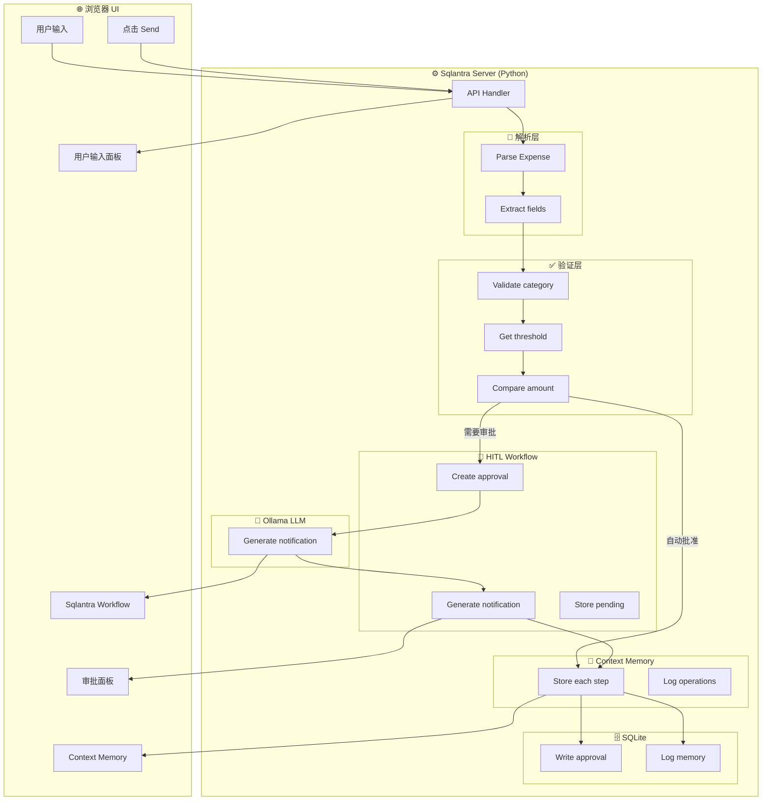
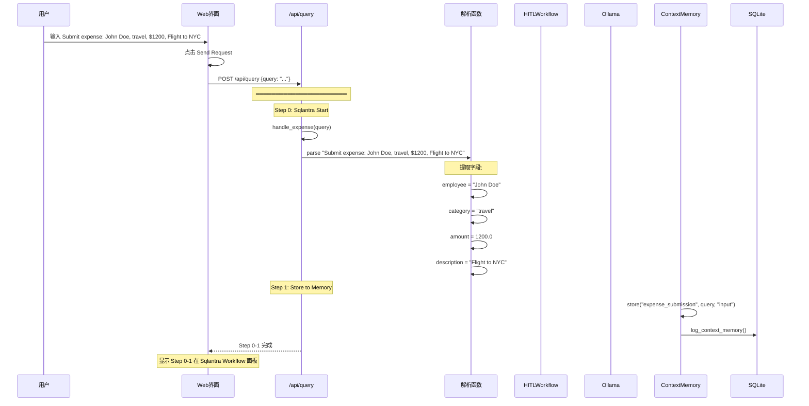
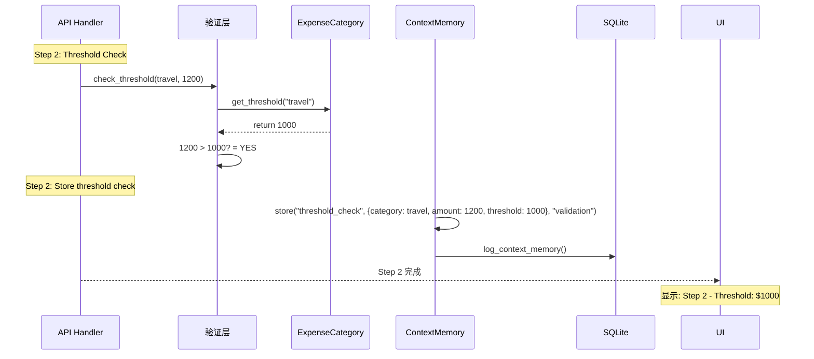
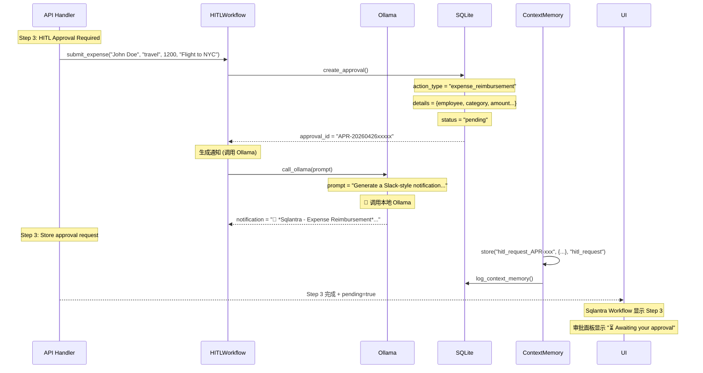
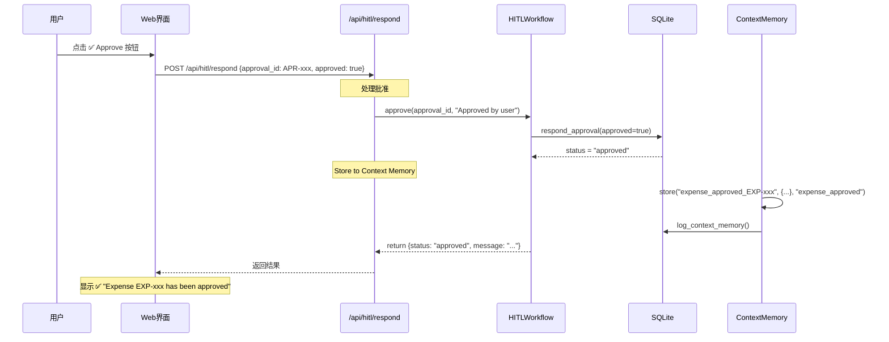
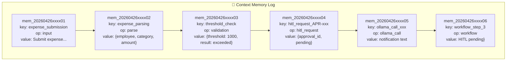
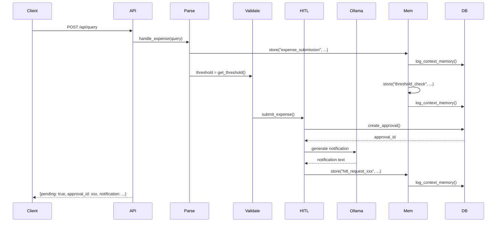

# HITL Expense Approval - 完整系统流程图

## 整体技术流程



---

## Step by Step 详细流程 (含 Context Memory)

### 1. 用户发送请求



### 2. 验证和阈值检查



### 3. 创建审批请求 (需要 Ollama)



### 4. 用户点击 Approve



---

## Context Memory 完整日志

当用户提交 `Submit expense: John Doe, travel, $1200, Flight to NYC` 时，Context Memory 记录：



| Step | Key | Operation | Value | 说明 |
|-----:|-----|-----------|-------|------|
| 0 | `expense_submission` | input | Submitted expense query | 用户输入 |
| 1 | `expense_parsing` | parse | {employee: John Doe, category: travel, amount: 1200} | 解析结果 |
| 2 | `threshold_check` | validation | {threshold: $1000, amount: $1200, exceeded: true} | 阈值检查 |
| 3 | `hitl_request_APR-xxx` | hitl_request | {approval_id, status: pending} | 审批请求创建 |
| 3 | `ollama_call_xxx` | ollama_call | Notification text from Ollama | LLM 生成通知 |
| 3 | `workflow_complete` | workflow | {steps: 4} | 工作流完成 | |

---

## Sqlantra Workflow 面板显示内容

每个 Step 在 Sqlantra Workflow 面板的显示：

```
┌────────────────────────────────────────────────────────────────┐
│  ⚙️ Sqlantra System Workflow                              │
├────────────────────────────────────────────────────────────────┤
│  Step 0: ⚡ Sqlantra Start Processing                    │
│    Detail: Processing expense submission         │
│    Code:  Employee: John Doe, Category: travel,    │
│           Amount: $1200.00                       │
├────────────────────────────────────────────────────────────────┤
│  Step 1: 📝 Expense Validation                    │
│    Detail: Validating expense details...             │
│    Code:  Category: travel, Amount: $1200.00     │
├────────────────────────────────────────────────────────────────┤
│  Step 2: ⚖️ Threshold Check                     │
│    Detail: Checking approval threshold...      │
│    Code:  Threshold: $1000 (travel)          │
├────────────────────────────────────────────────────────────────┤
│  Step 3: 🔔 HITL Approval Required ⭐           │
│    Detail: Amount $1200 exceeds $1000           │
│           threshold - approval needed          │
│    Code:  Pending Approval: APR-20260426xxxxx   │
│           <span class='warning'>⏳ PENDING</span> │
└────────────────────────────────────────────────────────────────┘
                          ↓
              ┌────────────────────────────────┐
              │   🔔 Pending Approvals         │
              │   🤖 Sqlantra - Expense Reimbursement│
              │   John Doe                    │
              │   travel | $1200.00           │
              │   ⏳ Awaiting Approval        │
              │   [✅ Approve] [❌ Reject]     │
              └────────────────────────────────┘
```

---

## Ollama 调用详情

当 Step 3 执行时，HITL Workflow 调用本地 Ollama 生成通知：

```
URL: http://localhost:11434/api/generate
Model: qwen3.5:2b-q4_K_M

Prompt:
"""
Generate a Slack-style notification for expense reimbursement approval.

Employee: John Doe
Category: travel
Amount: $1200.00
Description: Flight to NYC

The notification should:
- Start with "🤖 *Sqlantra - Expense Reimbursement*"
- Include employee, amount, category
- Be concise (under 200 chars)
- Mention awaiting approval
"""

Response:
"🤖 *Sqlantra - Expense Reimbursement*

*John Doe* submitted a *$1200.00* expense for *travel*

Description: Flight to NYC

💰 Amount: $1200.00 (threshold: $1000)

⚠️ Awaiting your approval"
```

---

## 完整 API 调用链



*文档更新时间: 2026-04-26*