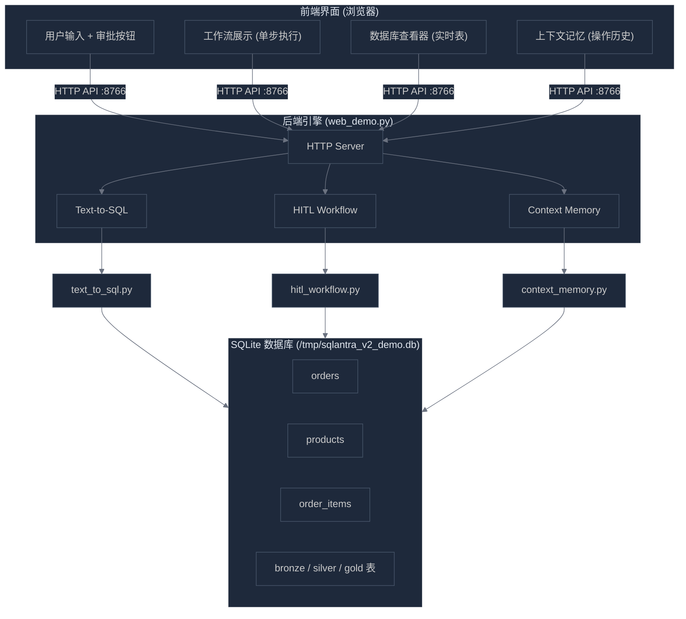
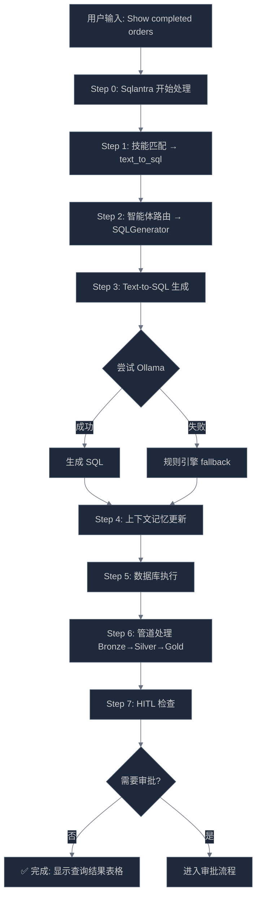
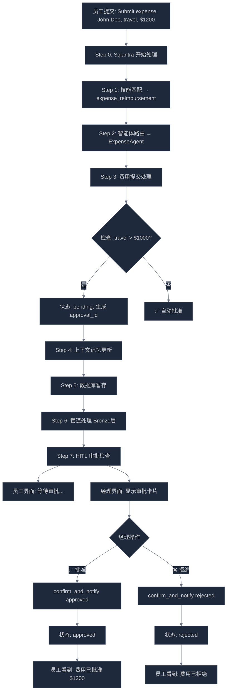
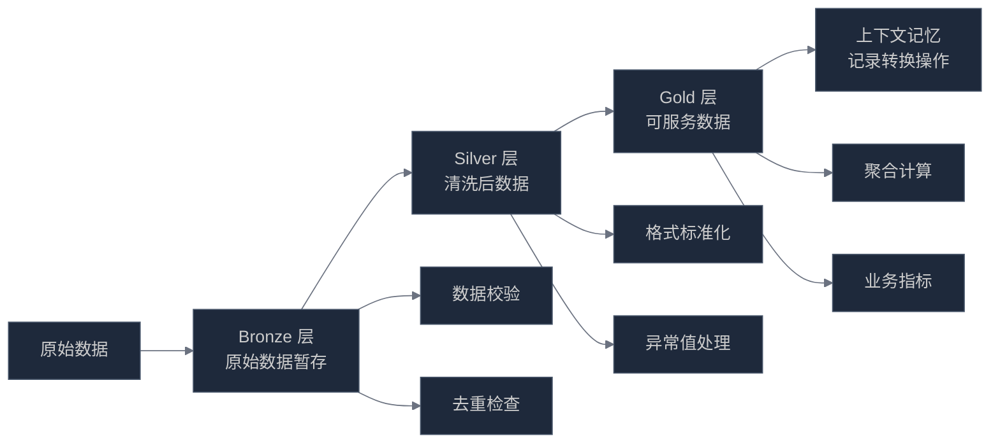
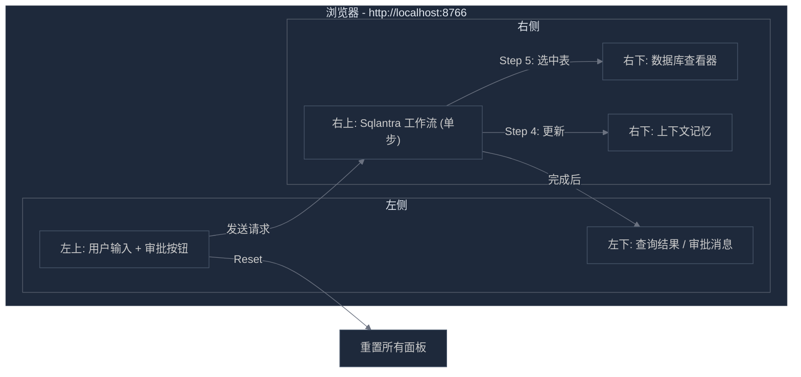
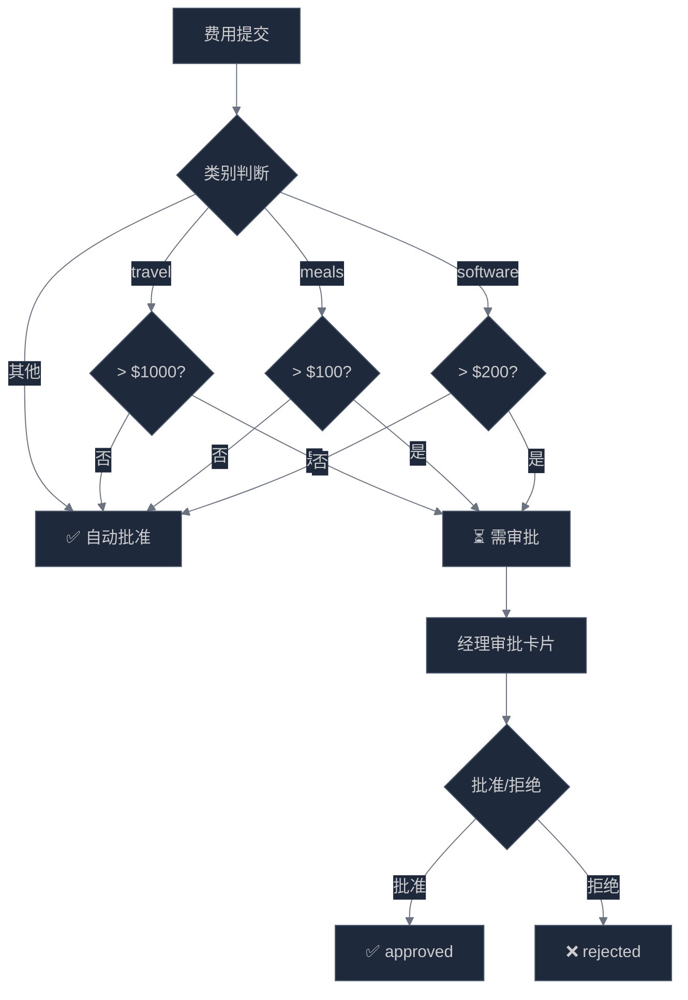
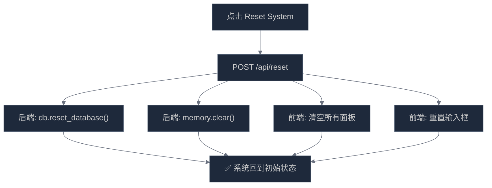
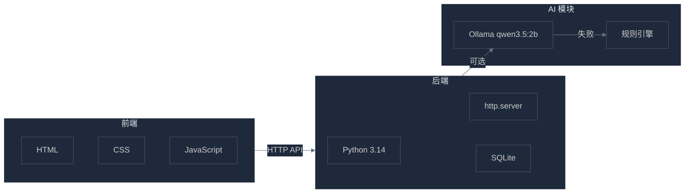
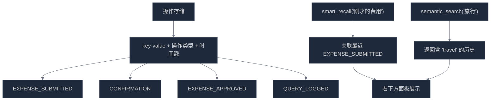

# Sqlantra System V3 - 项目全景图
> 全 Mermaid 图表版本，无文字描述。

---

## 1. 系统总览

---

## 2. Text-to-SQL 查询流程

---

## 3. HITL 费用审批流程

---

## 4. 数据管道流程

---

## 5. 界面布局与数据流向

---

## 6. 审批阈值决策

---

## 7. 系统重置流程

---

## 8. 技术栈总览

---

## 9. 上下文记忆智能召回

