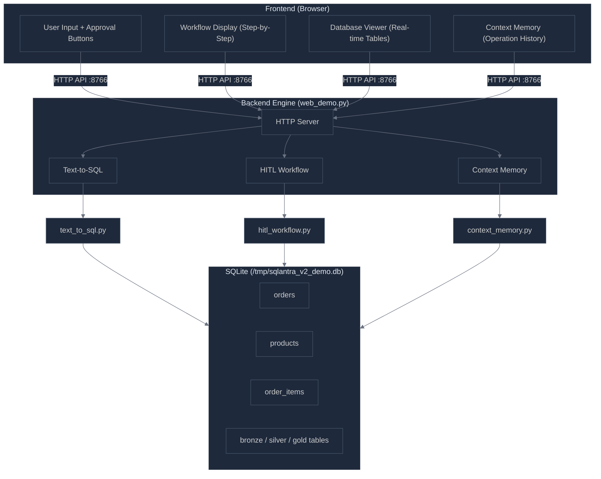
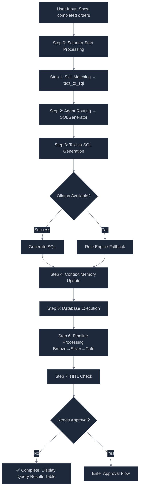
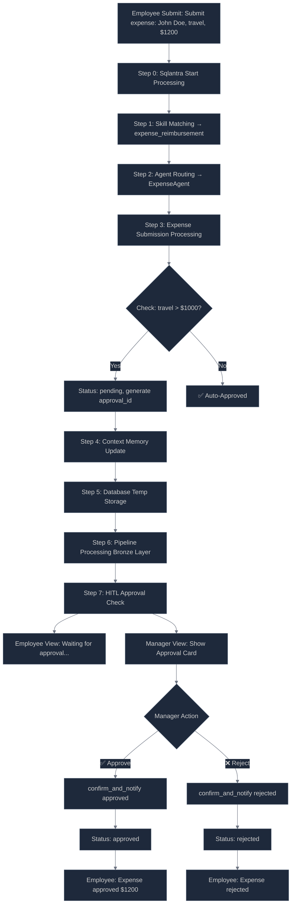
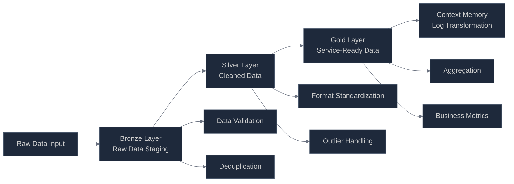
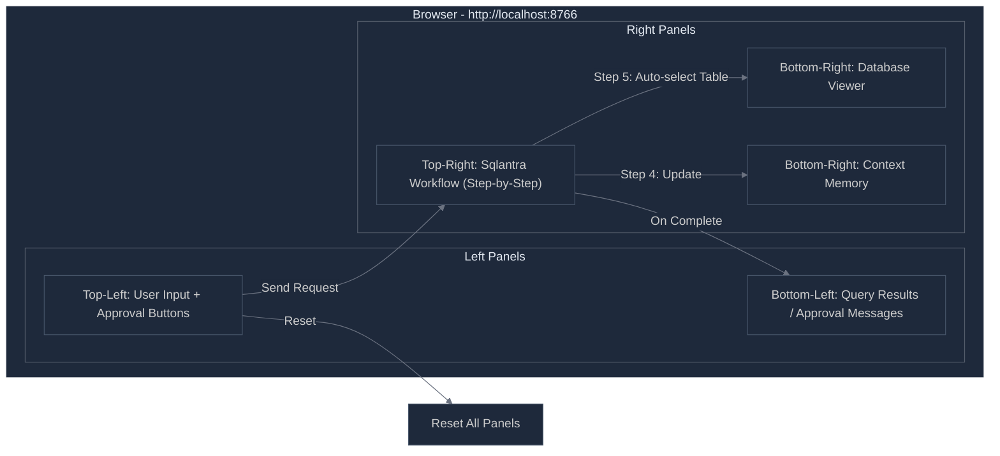
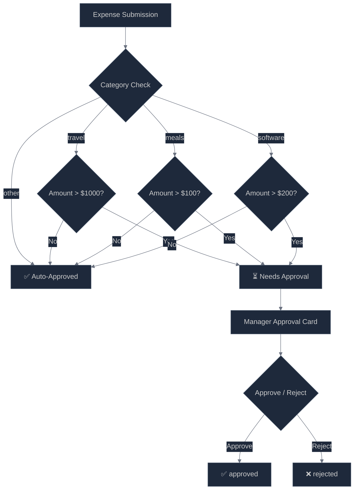
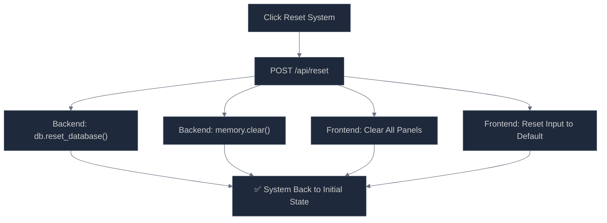
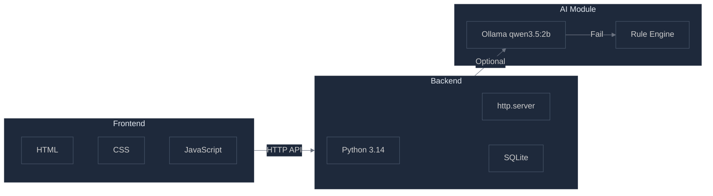
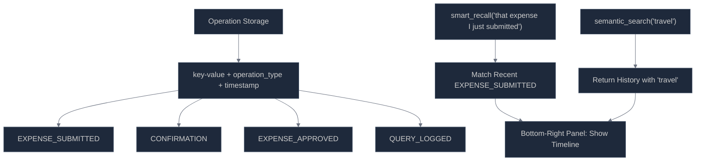

# Sqlantra System V3 - Project Overview (English Version)
> All Mermaid diagrams, no text descriptions. For non-Chinese speakers.

---

## 1. System Architecture

---

## 2. Text-to-SQL Query Flow

---

## 3. HITL Expense Approval Flow

---

## 4. Data Pipeline Flow

---

## 5. UI Layout & Data Flow

---

## 6. Approval Threshold Decision

---

## 7. System Reset Flow

---

## 8. Tech Stack Overview

---

## 9. Context Memory Recall

