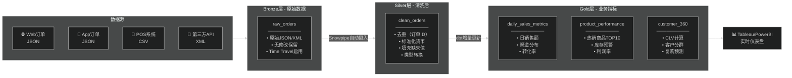
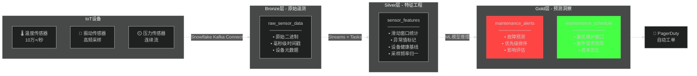

# Snowflake Data Pipeline Demo Scenarios
> 为什么需要 Bronze/Silver/Gold？在 Snowflake 作为 Data Warehouse 的场景下，分层架构的意义在于：
> - **Bronze**: 保留原始数据完整性（合规、审计、可追溯）
> - **Silver**: 数据清洗与标准化（去重、格式统一、质量保障）
> - **Gold**: 业务就绪的数据服务（聚合、指标、可消费）

---

## 场景1：电商全渠道订单分析

**关键价值**：
- Bronze保留原始订单（争议时可追溯）
- Silver确保数据质量（一处清洗，全局复用）
- Gold直接服务业务（零ETL延迟）

---

## 场景2：IoT设备预测性维护

**关键价值**：
- Bronze处理高吞吐原始流（Snowflake弹性算力）
- Silver做实时特征工程（窗口函数+UDF）
- Gold输出可行动洞察（集成ML模型）

---

## 场景3：金融实时反欺诈

```mermaid
%%{init: {'theme': 'dark'}}%%
flowchart LR
    subgraph Transactions["交易流"]
        CARD["💳 信用卡交易<br/>10K TPS"]
        WIRE["🏦 电汇转账<br/>高金额"]
        CRYPTO["₿ 加密货币<br/>区块链"]
    end

    Transactions -->|Snowflake Data Sharing| Bronze

    subgraph Bronze["Bronze层 - 原始交易"]
        B_TX["raw_transactions<br/>──────────<br/>• 完整交易报文<br/>• 原始IP/设备指纹<br/>• 未脱敏（加密存储）"]
    end

    Bronze -->|Dynamic Table物化视图| Silver

    subgraph Silver["Silver层 - 风险特征"]
        S_RISK["risk_features<br/>──────────<br/>• 速度检查（1h内N笔）<br/>• 地理异常（跨国跳）<br/>• 行为基线偏离<br/>• 黑名单匹配"]
    end

    Silver -->|Snowpark Python UDF| Gold

    subgraph Gold["Gold层 - 实时决策"]
        G_SCORE["fraud_scores<br/>──────────<br/>• 实时风险评分<br/>• 置信区间<br/>• 规则触发明细"]
        G_ACTION["auto_actions<br/>──────────<br/>• 自动冻结<br/>• 人工审核队列<br/>• 合规报告"]
    end

    Gold -->|Zero-Copy Cloning| AUDIT["📋 监管审计<br/>不可变快照"]

    style G_SCORE fill:#ffaa00,stroke:#ffcc44
    style G_ACTION fill:#ff4444,stroke:#ff6666
    style AUDIT fill:#4444ff,stroke:#6666ff
```

**关键价值**：
- Bronze满足合规（数据保留政策+加密）
- Silver实时特征计算（Dynamic Table自动刷新）
- Gold秒级决策（Snowpark原生Python执行）
- Audit零拷贝克隆（瞬间生成审计环境）

---

## 对比：为什么Snowflake让分层更有意义？

| 传统数仓 | Snowflake + 分层 |
|-----------|------------------|
| 每层需独立存储 | Zero-copy克隆，存储成本接近0 |
| ETL延迟小时级 | Snowpipe秒级摄入 |
| 难以追溯原始 | Time Travel可回溯90天 |
| 特征工程困难 | Snowpark原生支持Python/Java |
| 合规审计复杂 | Data Sharing + 克隆秒级交付 |

> **核心思想**：分层不是技术负担，而是**数据治理的边界**——Bronze保护原始、Silver保证质量、Gold服务业务。
