# Sqlantra System V3 - Architecture Research & Demo Design

## 目录 (Table of Contents)

1. [Data Warehouse vs ERP 区别](#1-data-warehouse-vs-erp-区别)
2. [Snowflake Cortex 集成场景](#2-snowflake-cortex-集成场景)
3. [MySQL 和 MongoDB Atlas Demo 设计](#3-mysql-和-mongodb-atlas-demo-设计)
4. [可扩展后端服务架构](#4-可扩展后端服务架构)
5. [Kubernetes 微服务架构](#5-kubernetes-微服务架构)
6. [Multi-tenant SaaS 架构 (小学生解释版)](#6-multi-tenant-saas-架构-小学生解释版)
7. [API 管理工具原理 (Postman)](#7-api-管理工具原理-postman)
8. [Bronze/Silver/Gold 数据管道分析](#8-bronzesilvergold-数据管道分析)
9. [Context Memory System 分析](#9-context-memory-system-分析)
10. [MCP Tool Registry 设计](#10-mcp-tool-registry-设计)
11. [综合 Demo 流程设计](#11-综合-demo-流程设计)

---

## 1. Data Warehouse vs ERP 区别

### 核心概念 (用小学生能听懂的话)

```
┌─────────────────────────────────────────────────────────────────────────┐
│                    ERP vs Data Warehouse - 简单比喻                     │
├─────────────────────────────────────────────────────────────────────────┤
│                                                                         │
│   ERP = 快餐店的厨房                                                  │
│   ┌──────────────────────────────────────┐                             │
│   │  🍔 快餐店厨房                       │                             │
│   │  • 只负责快速完成眼前的一单           │                             │
│   │  • 实时操作：点餐、做菜、结账        │                             │
│   │  • 不适合分析过去一年的所有订单        │                             │
│   └──────────────────────────────────────┘                             │
│                                                                         │
│   Data Warehouse = 研究中心/实验室                                      │
│   ┌──────────────────────────────────────┐                             │
│   │  🔬 研究中心                         │                             │
│   │  • 专门做深度分析                    │                             │
│   │  • 收集多年历史数据                  │                             │
│   │  • 发现趋势、预测未来                 │                             │
│   └──────────────────────────────────────┘                             │
│                                                                         │
└─────────────────────────────────────────────────────────────────────────┘
```

### 详细对比

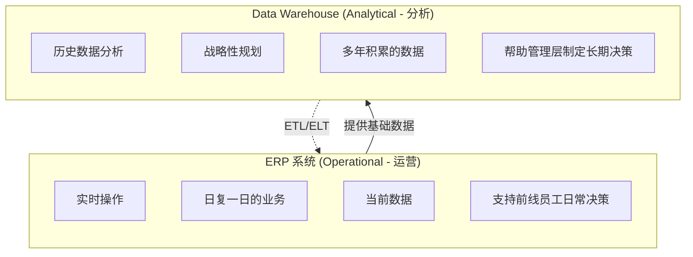

| 特性 | ERP | Data Warehouse |
|------|-----|----------------|
| **目的** | 日常业务操作 | 历史数据分析 |
| **数据** | 当前、实时 | 历史、累积 |
| **用户** | 前线员工、会计、销售 | 数据分析师、管理层 |
| **查询** | 简单快速 | 复杂深度分析 |
| **数据量** | 适量 | 海量 |
| **更新** | 实时 | 定期批量 |

### 为什么两者需要共存？

```
┌─────────────────────────────────────────────────────────────────────┐
│                    ERP + Data Warehouse 协同工作                     │
└─────────────────────────────────────────────────────────────────────┘

  ┌─────────┐      ┌──────────────┐      ┌─────────────────┐
  │  ERP    │ ──▶  │    ETL      │ ──▶  │ Data Warehouse  │
  │ (日常)  │      │ (抽取转换)   │      │    (分析)       │
  └─────────┘      └──────────────┘      └─────────────────┘
       │                                           │
       │ 销售单: 今天卖出100个                    │ 分析: 过去5年
       │ 库存: 还剩50个                          │ 销售趋势分析
       │ 订单: 客户A订购                         │ 预测: 明年需求
       │                                           │
       ▼                                           ▼
  快餐店厨房                              研究中心
  (立即使用)                              (战略规划)
```

---

## 2. Snowflake Cortex 集成场景

### 背景: 什么是 Snowflake Cortex?

```
┌─────────────────────────────────────────────────────────────────────┐
│                  Snowflake Cortex = AI 数据云平台                     │
└─────────────────────────────────────────────────────────────────────┘

  ┌─────────────────────────────────────────────────────────────┐
  │                    Snowflake 平台                            │
  │  ┌───────────────┐  ┌──────────────┐  ┌───────────────┐   │
  │  │   存储层      │  │   计算层      │  │   AI 层       │   │
  │  │   (数据)      │  │  (处理)       │  │  (Cortex)    │   │
  │  │               │  │               │  │               │   │
  │  │ • 结构化数据   │  │ • SQL查询     │  │ • LLM模型    │   │
  │  │ • 半结构化数据 │  │ • 数据转换    │  │ • 向量搜索   │   │
  │  │ • 文件        │  │ • 机器学习    │  │ • 分析       │   │
  │  └───────────────┘  └──────────────┘  └───────────────┘   │
  └─────────────────────────────────────────────────────────────┘
```

### Brainstorming: Sqlantra 与 Snowflake Cortex 集成场景

#### 场景 1: 智能销售分析助手 (最简单 ⭐)

**场景描述**: 用户问"上季度销售最好的产品是什么？"，Sqlantra调用Cortex Analyst生成SQL查询Snowflake，返回分析结果。

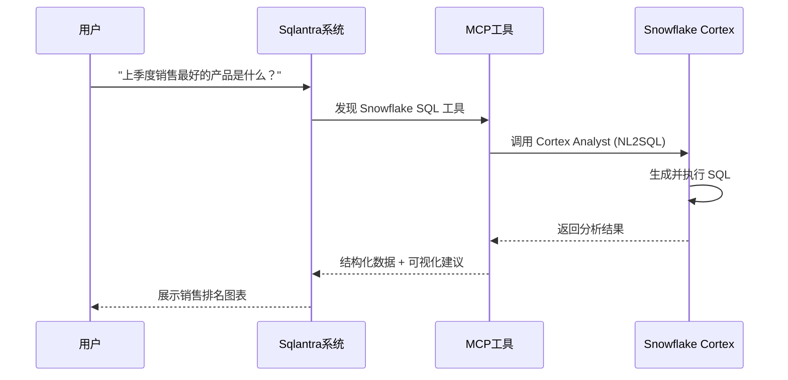

**实现难度**: ⭐ (最简单)
- 只需一个 MCP Connector 连接 Snowflake
- 利用 Cortex Analyst 的 NL2SQL 能力
- 前端展示结果

#### 场景 2: 多数据源联合分析 (中等 ⭐⭐)

**场景描述**: 用户问"结合CRM数据和销售数据，分析客户满意度与购买频率的关系"，Sqlantra需要协调多个Cortex工具。

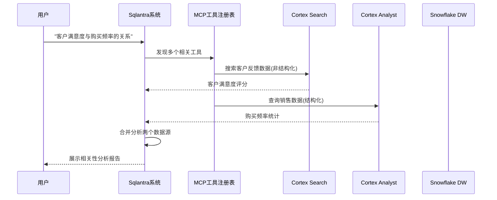

**实现难度**: ⭐⭐ (中等)
- 需要注册多个MCP工具
- Sqlantra需要数据融合逻辑
- 更复杂的可视化

#### 场景 3: AI Agent 自动决策工作流 (复杂 ⭐⭐⭐)

**场景描述**: 用户说"分析库存数据，如果某个产品库存低于阈值，自动生成采购建议并发送邮件"，展示完整的A2A+MCP协同。

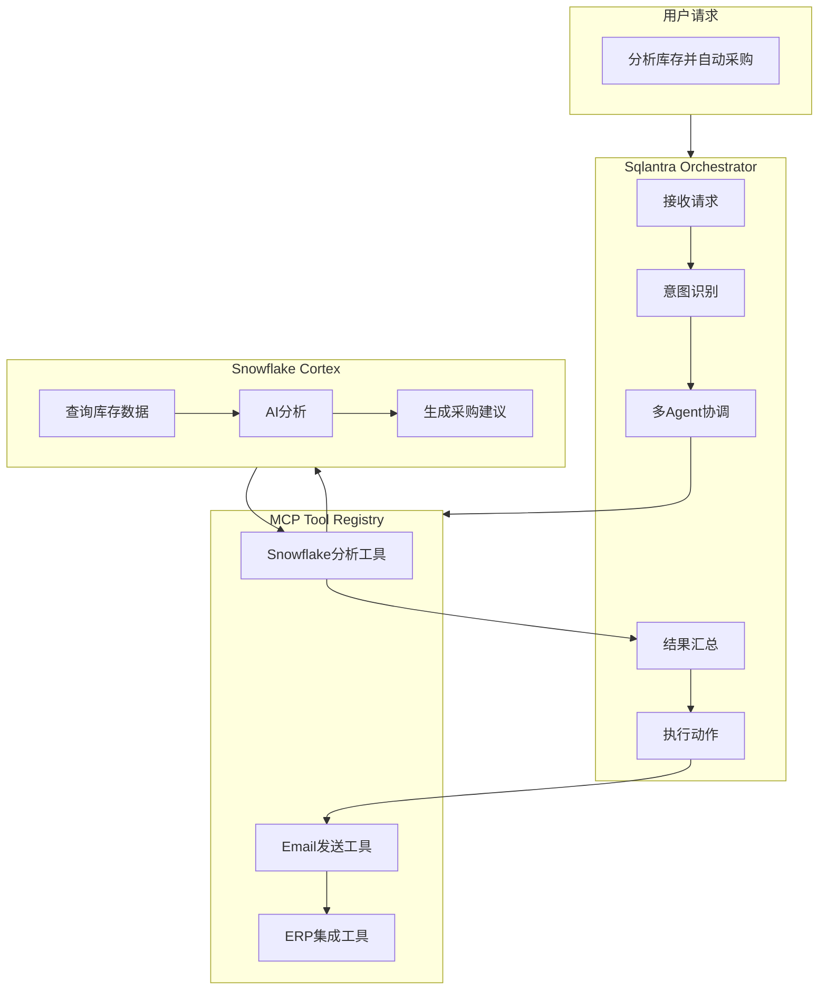

**实现难度**: ⭐⭐⭐ (复杂)
- 需要完整的Agent编排
- MCP工具需要支持actions
- 异步任务处理

---

## 3. MySQL 和 MongoDB Atlas Demo 设计

### 3.1 MySQL Demo 场景

#### 为什么选择 MySQL?

```
┌─────────────────────────────────────────────────────────────────────┐
│                         MySQL 特点                                  │
├─────────────────────────────────────────────────────────────────────┤
│                                                                     │
│  ✓ 关系型数据库 - 表格、行列、外键                                    │
│  ✓ 成熟稳定 - 30+年历史                                            │
│  ✓ ACID 事务 - 数据一致性保证                                        │
│  ✓ 复杂查询 - JOIN、子查询、存储过程                                  │
│  ✓ 索引优化 - B-tree、Full-text                                    │
│                                                                     │
│  适用场景: 财务系统、订单管理、用户账户                               │
│                                                                     │
└─────────────────────────────────────────────────────────────────────┘
```

#### Brainstorming: MySQL Demo 场景

**场景 1: 财务流水查询 (简单 ⭐)**

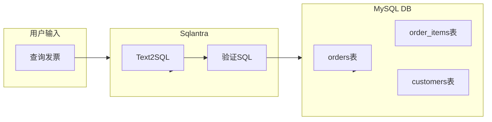

**Demo要点**:
- 展示 Sqlantra 如何生成复杂 JOIN 查询
- 展示 MySQL 索引如何加速查询
- 展示事务一致性

**场景 2: 跨表关联分析 (中等 ⭐⭐)**

用户: "显示所有超过30天未发货的订单及其对应的客户信息"

```sql
-- 生成的 SQL 可能是这样的
SELECT o.*, c.name, c.email, DATEDIFF(NOW(), o.order_date) as pending_days
FROM orders o
JOIN customers c ON o.customer_id = c.id
WHERE o.status = 'pending' 
  AND DATEDIFF(NOW(), o.order_date) > 30
ORDER BY pending_days DESC;
```

**Demo要点**:
- 复杂多表 JOIN
- 日期计算
- 排序和过滤

**场景 3: 实时聚合分析 (复杂 ⭐⭐⭐)**

用户: "按月份和地区统计销售额，并显示同比增长"

```sql
WITH monthly_sales AS (
    SELECT 
        DATE_FORMAT(order_date, '%Y-%m') as month,
        region,
        SUM(total_amount) as total
    FROM orders
    GROUP BY DATE_FORMAT(order_date, '%Y-%m'), region
)
SELECT 
    month, region, total,
    LAG(total) OVER (PARTITION BY region ORDER BY month) as prev_month,
    (total - LAG(total) OVER (PARTITION BY region ORDER BY month)) / LAG(total) * 100 as growth_pct
FROM monthly_sales
ORDER BY month DESC, region;
```

### 3.2 MongoDB Atlas Demo 场景

#### 为什么选择 MongoDB Atlas?

```
┌─────────────────────────────────────────────────────────────────────┐
│                    MongoDB Atlas 特点                               │
├─────────────────────────────────────────────────────────────────────┤
│                                                                     │
│  ✓ 文档数据库 - JSON/BSON 格式                                     │
│  ✓ 灵活 Schema - 无需预定义结构                                     │
│  ✓ 水平扩展 - 分片集群                                              │
│  ✓ 地理空间 - 内置地理位置支持                                       │
│  ✓ Atlas Services - Atlas Search, Data API                          │
│                                                                     │
│  适用场景: 日志、内容管理、IoT、实时分析                              │
│                                                                     │
└─────────────────────────────────────────────────────────────────────┘
```

#### Brainstorming: MongoDB Demo 场景

**场景 1: 客户行为分析 (简单 ⭐)**

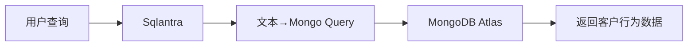

**MongoDB Query 示例**:
```javascript
// 用户: "显示最近登录的所有付费用户"
// 生成的查询:
db.users.find({
    plan: "premium",
    lastLogin: { $gte: new Date(Date.now() - 7*24*60*60*1000) }
}).sort({ lastLogin: -1 })
```

**场景 2: 日志分析平台 (中等 ⭐⭐)**

```javascript
// 用户: "显示错误率最高的5个API端点"
// 聚合管道
db.api_logs.aggregate([
    { $match: { level: "error" } },
    { $group: { _id: "$endpoint", count: { $sum: 1 } } },
    { $sort: { count: -1 } },
    { $limit: 5 }
])
```

**场景 3: 实时仪表盘 (复杂 ⭐⭐⭐)**

用户: "显示实时活跃用户数和他们的最近操作"

```javascript
// 使用 MongoDB Change Streams 实现实时更新
db.users.watch([
    { $match: { operationType: "update" } }
])
```

---

## 4. 可扩展后端服务架构

### 4.1 技术栈选择

```
┌─────────────────────────────────────────────────────────────────────┐
│                      后端技术栈选项                                   │
├─────────────────────────────────────────────────────────────────────┤
│                                                                     │
│  ┌─────────────┐  ┌─────────────┐  ┌─────────────┐                │
│  │  Python     │  │  Node.js    │  │    Go       │                │
│  │  (FastAPI)  │  │  (Express)  │  │  (Gin)     │                │
│  ├─────────────┤  ├─────────────┤  ├─────────────┤                │
│  │ + LangChain │  │ + TypeScript│  │ + gRPC     │                │
│  │ + SQLAlchemy│  │ + Prisma    │  │ + Goroutines│                │
│  └─────────────┘  └─────────────┘  └─────────────┘                │
│                                                                     │
│  选择依据:                                                           │
│  • Python: AI/ML 集成、数据处理                                      │
│  • Node.js: 实时Web、TypeScript前后端统一                           │
│  • Go: 高性能服务、gRPC、微服务                                     │
│                                                                     │
└─────────────────────────────────────────────────────────────────────┘
```

### 4.2 Sqlantra 系统架构演进

#### 当前架构 (SQLite)

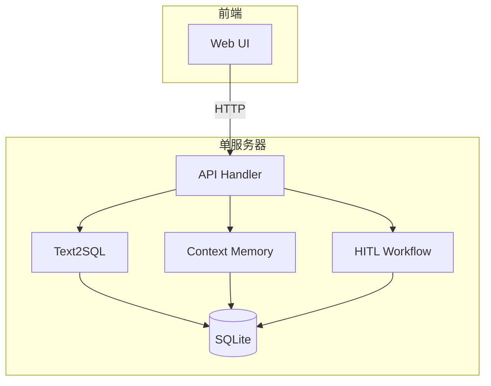

#### 目标架构 (多数据库支持)

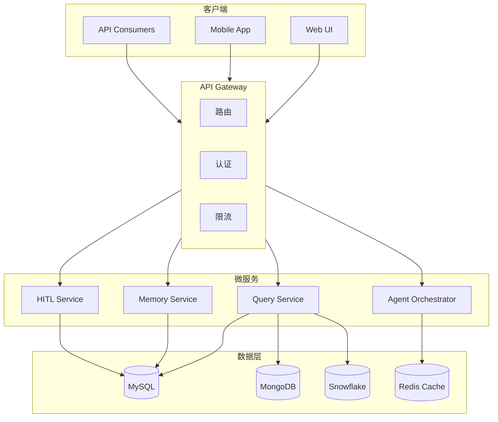

### 4.3 REST vs gRPC

```
┌─────────────────────────────────────────────────────────────────────┐
│                      REST vs gRPC 对比                              │
├─────────────────────────────────────────────────────────────────────┤
│                                                                     │
│  ┌──────────────────┐      ┌──────────────────┐                   │
│  │     REST         │      │     gRPC         │                   │
│  ├──────────────────┤      ├──────────────────┤                   │
│  │ HTTP/1.1        │      │ HTTP/2          │                   │
│  │ JSON            │      │ Protocol Buffers │                   │
│  │ 人类可读        │      │ 更小更快         │                   │
│  │ 广泛支持        │      │ 强类型           │                   │
│  │ 浏览器友好      │      │ 流式支持         │                   │
│  └──────────────────┘      └──────────────────┘                   │
│                                                                     │
│  使用场景:                                                           │
│  • REST: 外部API、浏览器客户端、文档友好                             │
│  • gRPC: 服务间通信、微服务内部、高性能场景                          │
│                                                                     │
└─────────────────────────────────────────────────────────────────────┘
```

### 4.4 Brainstorming: 后端架构改进

**想法 1: 分层 API 服务 (简单 ⭐)**

```
┌─────────────────────────────────────────┐
│           REST API Layer                │
│  /api/v1/query  /api/v1/memory        │
└──────────────────┬──────────────────────┘
                   │
┌──────────────────▼──────────────────────┐
│         Business Logic Layer            │
│  QueryService  MemoryService            │
└──────────────────┬──────────────────────┘
                   │
┌──────────────────▼──────────────────────┐
│           Data Access Layer            │
│  MySQLAdapter  MongoAdapter            │
└─────────────────────────────────────────┘
```

**想法 2: 事件驱动架构 (中等 ⭐⭐)**

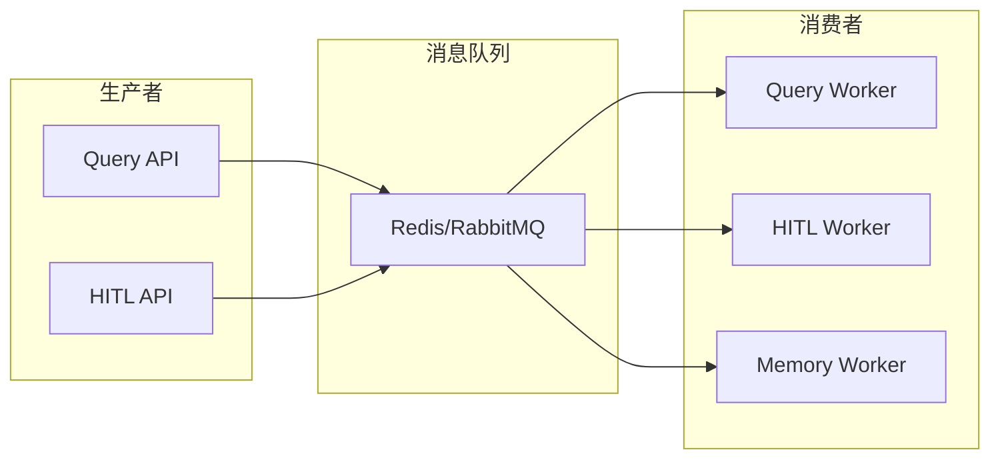

**想法 3: 完整微服务架构 (复杂 ⭐⭐⭐)**

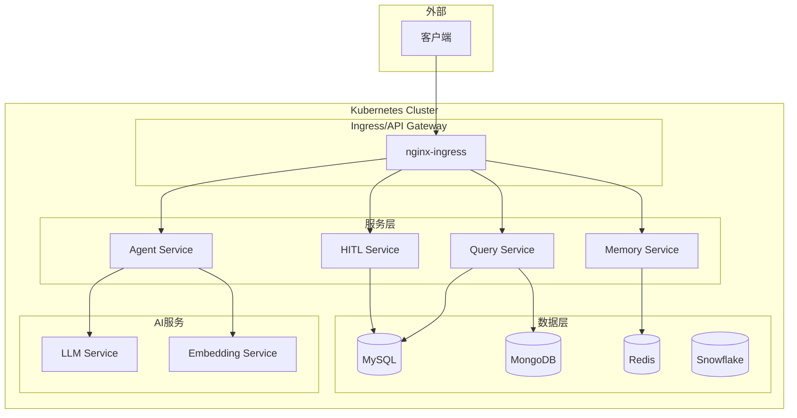

---

## 5. Kubernetes 微服务架构

### 5.1 核心概念

```
┌─────────────────────────────────────────────────────────────────────┐
│                  Kubernetes = 容器编排系统                          │
├─────────────────────────────────────────────────────────────────────┤
│                                                                     │
│  想象一下:                                                           │
│  • 容器 = 标准化集装箱 (Docker)                                     │
│  • Pod = 集装箱组 (运行在一起的容器)                                 │
│  • Service = 集装箱码头 (稳定的访问入口)                             │
│  • Deployment = 部署计划 (管理多个副本)                              │
│  • Ingress = 大门 (外部流量入口)                                    │
│  • ConfigMap = 配置文件                                             │
│  • Secret = 敏感信息                                                │
│  • Namespace = 隔离区域 (不同环境/租户)                             │
│                                                                     │
└─────────────────────────────────────────────────────────────────────┘
```

### 5.2 Sqlantra 在 Kubernetes 上的部署

```mermaid
flowchart TB
    subgraph K8s["Kubernetes Cluster"]
        subgraph Namespace_Sqlantra["Namespace: sqlantra-system"]
            subgraph Ingress["Ingress"]
                I[API Gateway]
            end
            
            subgraph Deployments["Deployments"]
                D1[sqlantra-query-svc]
                D2[sqlantra-agent-svc]
                D3[sqlantra-memory-svc]
                D4[sqlantra-hitl-svc]
            end
            
            subgraph Services["Services"]
                S1[query-service]
                S2[agent-service]
                S3[memory-service]
                S4[hitl-service]
            end
            
            subgraph Config["Config & Secrets"]
                CM[ConfigMap: db-config]
                SC[Secret: api-keys]
            end
            
            subgraph Storage["Storage"]
                PVC[(PersistentVolumeClaim)]
            end
        end
    end
    
    External[外部流量] --> I
    I --> S1
    I --> S2
    I --> S3
    I --> S4
    
    S1 --> D1
    S2 --> D2
    S3 --> D3
    S4 --> D4
    
    D1 --> CM
    D2 --> CM
    D3 --> CM
    D4 --> CM
    
    D1 --> SC
    D2 --> SC
    
    D3 --> PVC
end
```

### 5.3 Brainstorming: K8s 部署策略

**想法 1: 基础部署 (简单 ⭐)**

```yaml
# deployment.yaml (简化版)
apiVersion: apps/v1
kind: Deployment
metadata:
  name: sqlantra-query-service
spec:
  replicas: 2
  selector:
    matchLabels:
      app: sqlantra-query
  template:
    spec:
      containers:
      - name: query
        image: sqlantra/query-service:latest
        ports:
        - containerPort: 8000
        env:
        - name: DB_HOST
          valueFrom:
            configMapKeyRef:
              name: sqlantra-config
              key: db_host
```

**想法 2: 带健康检查和资源限制 (中等 ⭐⭐)**

```yaml
# 添加探针和资源限制
spec:
  containers:
  - name: query
    image: sqlantra/query-service:latest
    resources:
      requests:
        memory: "256Mi"
        cpu: "250m"
      limits:
        memory: "512Mi"
        cpu: "500m"
    livenessProbe:
      httpGet:
        path: /health
        port: 8000
      initialDelaySeconds: 30
      periodSeconds: 10
    readinessProbe:
      httpGet:
        path: /ready
        port: 8000
      initialDelaySeconds: 5
      periodSeconds: 5
```

**想法 3: 完整 GitOps 流程 (复杂 ⭐⭐⭐)**

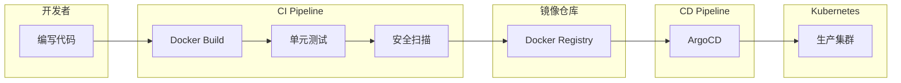

---

## 6. Multi-tenant SaaS 架构 (小学生解释版)

### 6.1 什么是 Multi-tenant?

```
┌─────────────────────────────────────────────────────────────────────┐
│                   Multi-tenant = 公寓大楼                           │
├─────────────────────────────────────────────────────────────────────┤
│                                                                     │
│  🏢 公寓大楼 = SaaS 应用                                            │
│  ┌─────────────────────────────────────────┐                       │
│  │  ╔═══════════════════════════════════╗  │                       │
│  │  ║  公寓 A    公寓 B    公寓 C     ║  │                       │
│  │  ║  👨‍💼       👩‍🎨       👨‍🔬     ║  │                       │
│  │  ║  租户A的数据  租户B的数据  租户C的数据║  │                       │
│  │  ║  (完全隔离)  (完全隔离)  (完全隔离)  ║  │                       │
│  │  ╚═══════════════════════════════════╝  │                       │
│  │  │  │  │  │  │  │  │  │  │  │       │                       │
│  │  ════════════════════════════════════  │                       │
│  │     共用设施: 水、电、电梯、停车场        │                       │
│  └─────────────────────────────────────────┘                       │
│                                                                     │
│  对比:                                                              │
│  • 单租户 = 独栋别墅 (自己维护所有东西)                              │
│  • 多租户 = 公寓楼 (共享设施, 只租一间)                             │
│                                                                     │
└─────────────────────────────────────────────────────────────────────┘
```

### 6.2 数据隔离策略

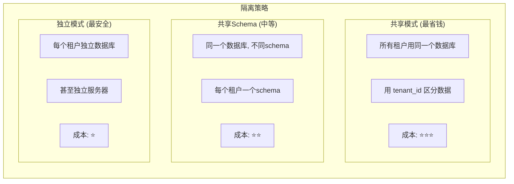

### 6.3 Multi-tenant 与企业系统集成

```
┌─────────────────────────────────────────────────────────────────────┐
│              Multi-tenant SaaS 与企业系统集成                        │
└─────────────────────────────────────────────────────────────────────┘

  ┌────────────────────────────────────────────────────────────────┐
  │                    企业客户 (Tenant)                           │
  │  ┌──────────┐  ┌──────────┐  ┌──────────┐                    │
  │  │   ERP    │  │   CRM    │  │   HR    │                    │
  │  │  系统    │  │  系统    │  │  系统    │                    │
  │  └────┬─────┘  └────┬─────┘  └────┬─────┘                    │
  │       │             │             │                           │
  │       └─────────────┼─────────────┘                           │
  │                     │                                          │
  │                     ▼                                          │
  │          ┌─────────────────────┐                              │
  │          │   SaaS API Gateway  │                              │
  │          │  (带租户识别)       │                              │
  │          └──────────┬──────────┘                              │
  │                     │                                          │
  │          ┌──────────▼──────────┐                              │
  │          │   Multi-tenant     │                              │
  │          │   SaaS Application │                              │
  │          │                    │                              │
  │          │  ┌────┐ ┌────┐    │                              │
  │          │  │T1数据│ │T2数据│    │  ← 数据隔离              │
  │          │  └────┘ └────┘    │                              │
  │          └─────────────────────┘                              │
  └────────────────────────────────────────────────────────────────┘
```

### 6.4 Brainstorming: Multi-tenant 实现

**想法 1: 简单的租户ID过滤 (简单 ⭐)**

```python
# 每个查询自动添加租户过滤
def execute_query(user, sql):
    tenant_id = user.tenant_id
    # 自动添加 WHERE tenant_id = ?
    return db.execute(add_tenant_filter(sql, tenant_id))
```

**想法 2: 完整的多租户隔离 (中等 ⭐⭐)**

```yaml
# Kubernetes namespace 隔离
apiVersion: v1
kind: Namespace
metadata:
  name: tenant-acme-corp
---
apiVersion: v1
kind: ResourceQuota
metadata:
  name: tenant-acme-corp-quota
spec:
  hard:
    requests.cpu: "4"
    requests.memory: 8Gi
    pods: "10"
```

**想法 3: 企业级多租户 (复杂 ⭐⭐⭐)**

- 每租户独立的数据库实例
- 独立的身份认证 (SSO/SAML)
- 独立的数据保留策略
- 审计日志按租户隔离

---

## 7. API 管理工具原理 (Postman)

### 7.1 Postman 工作原理 (小学生解释版)

```
┌─────────────────────────────────────────────────────────────────────┐
│                  Postman = API 的瑞士军刀                           │
├─────────────────────────────────────────────────────────────────────┤
│                                                                     │
│  想象一下:                                                           │
│  • 你想给餐厅打电话订餐 (发送API请求)                                │
│  • Postman = 电话机 + 记录本                                        │
│  • 电话号码 = API 端点 URL                                           │
│  • 点菜内容 = 请求体 (JSON)                                          │
│  • 菜单上的菜品 = 响应数据                                           │
│  • 记录本 = 保存历史请求                                             │
│                                                                     │
│  Postman 能做:                                                       │
│  ✓ 发送各种HTTP请求 (GET/POST/PUT/DELETE)                           │
│  ✓ 保存和组织请求 (像书签)                                           │
│  ✓ 自动测试 (验证响应对不对)                                         │
│  ✓ 模拟服务器 (后端没写好也能测试)                                   │
│  ✓ 团队共享 (大家用同一套请求)                                       │
│                                                                     │
└─────────────────────────────────────────────────────────────────────┘
```

### 7.2 Postman 核心功能

```mermaid
flowchart TB
    subgraph Postman["Postman 工具"]
        direction TB
        
        Req[Request Builder]
        |-- 构建请求 --> URL[URL + Method]
        Req --> Headers[请求头]
        Req --> Body[请求体]
        Req --> Auth[认证]
        
        Res[Response Viewer]
        |-- 显示 --> Status[状态码]
        Res --> Time[响应时间]
        Res --> BodyR[响应体]
        Res --> HeadersR[响应头]
        
        Test[测试脚本]
        Test --> Assert[断言]
        Test --> Validate[验证]
        
        Collection[集合]
        Collection --> Folder[文件夹]
        Collection --> Env[环境变量]
        
        Runner[批量运行]
        Runner --> Newman[命令行工具]
        Runner --> CI[CI/CD集成]
    end
```

### 7.3 断言 (Assertions) 原理

```
┌─────────────────────────────────────────────────────────────────────┐
│                        断言 = 自动检查                              │
├─────────────────────────────────────────────────────────────────────┤
│                                                                     │
│  就像考试的标准答案:                                                  │
│  • 题目: API 返回 200 状态码                                        │
│  • 答案 (断言): pm.response.to.have.status(200)                   │
│  • 结果: 对 ✓ / 错 ✗                                               │
│                                                                     │
│  常用断言示例:                                                       │
│  ┌────────────────────────────────────────┐                       │
│  │ 1. 状态码 200?                         │                       │
│  │    pm.expect(pm.response.status).to.eql(200)                  │                       │
│  │                                         │                       │
│  │ 2. 响应时间 < 500ms?                   │                       │
│  │    pm.expect(pm.response.responseTime).to.be.below(500)       │                       │
│  │                                         │                       │
│  │ 3. 返回数据包含 "success"?              │                       │
│  │    pm.expect(jsonData.message).to.include("success")          │                       │
│  │                                         │                       │
│  │ 4. 响应头有 Content-Type?              │                       │
│  │    pm.response.to.have.header("Content-Type")                  │                       │
│  └────────────────────────────────────────┘                       │
│                                                                     │
└─────────────────────────────────────────────────────────────────────┘
```

---

## 8. Bronze/Silver/Gold 数据管道分析

### 8.1 为什么需要分层?

```
┌─────────────────────────────────────────────────────────────────────┐
│               Medallion Architecture (奖章架构)                      │
├─────────────────────────────────────────────────────────────────────┤
│                                                                     │
│  想象一下: 淘金的过程                                               │
│                                                                     │
│  🥉 Bronze (原金矿):                                                │
│     • 直接从矿山挖出来的石头                                         │
│     • 包含所有杂质                                                  │
│     • 原始、未处理                                                   │
│                                                                     │
│  🥈 Silver (提炼后):                                                │
│     • 经过筛选和初步清洗                                             │
│     • 去掉大部分杂质                                                │
│     • 已经是金属但还不是纯金                                         │
│                                                                     │
│  🥇 Gold (纯金):                                                   │
│     • 精炼后的纯净金条                                              │
│     • 可以直接使用/交易                                             │
│     • 最高品质                                                      │
│                                                                     │
└─────────────────────────────────────────────────────────────────────┘
```

### 8.2 在 Snowflake 中如何实现

```mermaid
flowchart LR
    subgraph Sources["数据源"]
        S1[ERP]
        S2[CRM]
        S3[Web日志]
    end
    
    subgraph Bronze["🥉 Bronze Layer"]
        B1[raw_orders]
        B2[raw_customers]
        B3[raw_events]
    end
    
    subgraph Silver["🥈 Silver Layer"]
        SL1[cleaned_orders]
        SL2[enriched_customers]
        SL3[aggregated_events]
    end
    
    subgraph Gold["🥇 Gold Layer"]
        G1[sales_daily_summary]
        G2[customer_lifetime_value]
        G3[revenue_by_region]
    end
    
    Sources --> Bronze
    Bronze -->|清洗/转换| Silver
    Silver -->|业务聚合| Gold
```

### 8.3 为什么在 Demo 中不太 make sense?

```
┌─────────────────────────────────────────────────────────────────────┐
│                    当前 Demo 的问题                                  │
├─────────────────────────────────────────────────────────────────────┤
│                                                                     │
│  问题:                                                               │
│  1. 数据量太小 - 只有几条测试数据                                    │
│  2. 实时查询 - 不是批量处理管道                                      │
│  3. 没有真正的转换 - Bronze和Silver数据一样                           │
│                                                                     │
│  更好的 Demo 场景:                                                   │
│                                                                     │
│  场景 1: 实时流处理                                                 │
│  • 用户每次查询 → 触发一次完整管道                                    │
│  • 展示数据逐层变化                                                  │
│                                                                     │
│  场景 2: 定时批处理 (更真实)                                         │
│  • 夜间运行 ETL 任务                                                │
│  • 早上展示昨天/上周/上月的聚合数据                                  │
│                                                                     │
│  场景 3: 增量更新                                                   │
│  • 只处理新数据/变化数据                                            │
│  • 展示效率差异                                                     │
│                                                                     │
└─────────────────────────────────────────────────────────────────────┘
```

---

## 9. Context Memory System 分析

### 9.1 当前实现状态

```
┌─────────────────────────────────────────────────────────────────────┐
│                   Context Memory 当前功能                            │
├─────────────────────────────────────────────────────────────────────┤
│                                                                     │
│  ✓ 存储:                                                            │
│    • 用户查询                                                        │
│    • 匹配的技能                                                     │
│    • 生成的SQL                                                      │
│    • 查询结果                                                       │
│    • HITL审批记录                                                   │
│                                                                     │
│  ✓ 特点:                                                            │
│    • 持久化到 SQLite                                               │
│    • 按时间顺序                                                      │
│    • 可搜索                                                          │
│                                                                     │
│  ✗ 缺失:                                                            │
│    • 跨会话记忆 (重启后丢失)                                         │
│    • 智能召回 (语义搜索)                                             │
│    • 对话上下文 (追问)                                               │
│                                                                     │
└─────────────────────────────────────────────────────────────────────┘
```

### 9.2 需要增强的功能

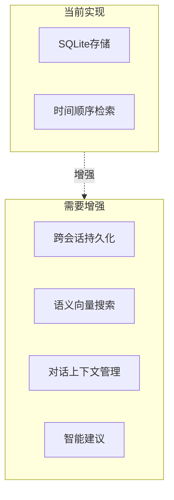

### 9.3 Brainstorming: 增强方案

**想法 1: 简单增强 (简单 ⭐)**

```python
# 添加会话ID支持
class ContextMemory:
    def store(self, key, value, operation, metadata, session_id=None):
        # 跨会话保存
        self.db.execute(
            "INSERT INTO memory VALUES (?, ?, ?, ?, ?, ?)",
            (session_id or "default", key, value, operation, metadata, datetime.now())
        )
    
    def recall(self, query, session_id=None):
        # 基本模糊搜索
        return self.db.execute(
            "SELECT * FROM memory WHERE key LIKE ? OR operation LIKE ?",
            (f"%{query}%", f"%{query}%")
        )
```

**想法 2: 向量语义搜索 (中等 ⭐⭐)**

```python
# 使用 embeddings 实现语义搜索
class SemanticMemory:
    def __init__(self):
        self.embeddings = EmbeddingService()
        self.vector_db = ChromaDB()
    
    def store(self, key, value, operation, metadata):
        # 生成向量
        vector = self.embeddings.encode(f"{key} {value}")
        self.vector_db.add(vector, {"key": key, "value": value})
    
    def recall(self, query):
        # 语义相似度搜索
        query_vector = self.embeddings.encode(query)
        return self.vector_db.search(query_vector, top_k=5)
```

**想法 3: 完整记忆系统 (复杂 ⭐⭐⭐)**

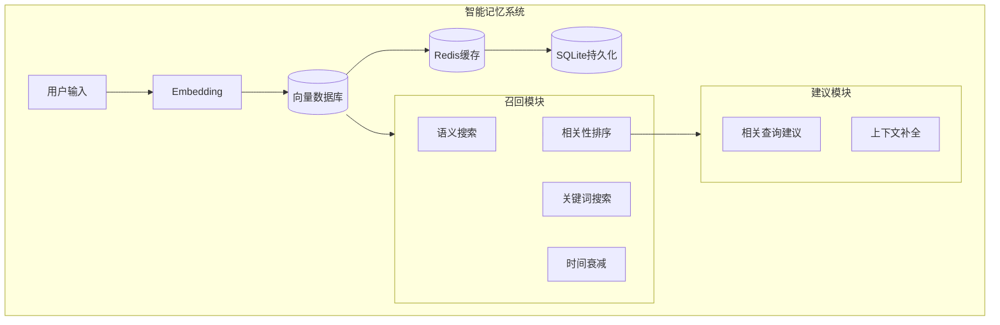

### 9.4 Demo 场景设计

**场景: 智能问答助手**

```
用户: "显示所有未付款发票"
  ↓
Sqlantra: 查询并返回结果，同时存储到记忆
  ↓
用户: "那个Acme公司的呢？"  (追问)
  ↓
Sqlantra: 从记忆中找到上一条查询 "未付款发票"
      结合上下文，理解为 "Acme公司未付款发票"
  ↓
用户: "还有哪些超过10000的？"  (继续追问)
  ↓
Sqlantra: 组合上下文 = Acme公司 + 未付款 + 超过10000
```

---

## 10. MCP Tool Registry 设计

### 10.1 什么是 MCP Tool Registry?

```
┌─────────────────────────────────────────────────────────────────────┐
│              MCP Tool Registry = 工具商店                            │
├─────────────────────────────────────────────────────────────────────┤
│                                                                     │
│  想象一下:                                                           │
│  • MCP = USB接口 (标准化连接方式)                                    │
│  • Tool = USB设备 (鼠标、键盘、打印机)                               │
│  • Registry = 驱动商店/设备目录                                      │
│                                                                     │
│  在AI世界:                                                          │
│  • AI Agent 需要各种工具                                            │
│  • 每个工具用 MCP 协议标准化                                         │
│  • Registry 列出所有可用工具及其功能                                  │
│                                                                     │
└─────────────────────────────────────────────────────────────────────┘
```

### 10.2 Registry 应该在哪里?

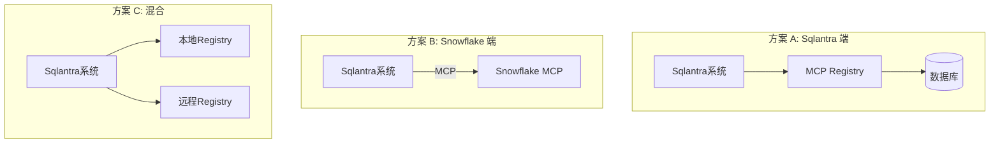

### 10.3 Brainstorming: Registry 实现

**想法 1: 静态配置 (简单 ⭐)**

```python
# config/mcp_tools.yaml
tools:
  - name: snowflake_query
    type: database
    connection: snowflake://...
    capabilities:
      - sql_query
      - analyze
    
  - name: send_email
    type: action
    provider: smtp
    capabilities:
      - send
      - template
```

**想法 2: 动态注册 (中等 ⭐⭐)**

```python
# MCP Tool Registry Service
class MCPRegistry:
    def __init__(self):
        self.tools = {}
    
    def register(self, tool_metadata):
        """工具启动时自动注册"""
        self.tools[tool_metadata.name] = tool_metadata
    
    def discover(self, capability):
        """Agent 查询可用工具"""
        return [t for t in self.tools.values() 
                if capability in t.capabilities]
    
    def call(self, tool_name, params):
        """调用工具"""
        return self.tools[tool_name].execute(params)
```

**想法 3: 分布式 Registry (复杂 ⭐⭐⭐)**

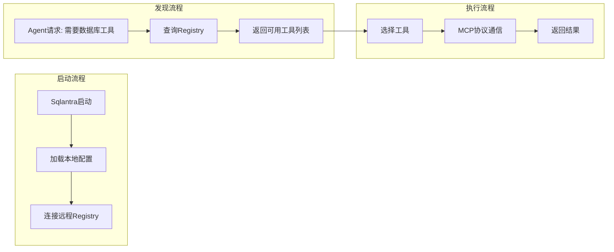

### 10.4 真实场景模拟 Demo

**Demo 流程:**

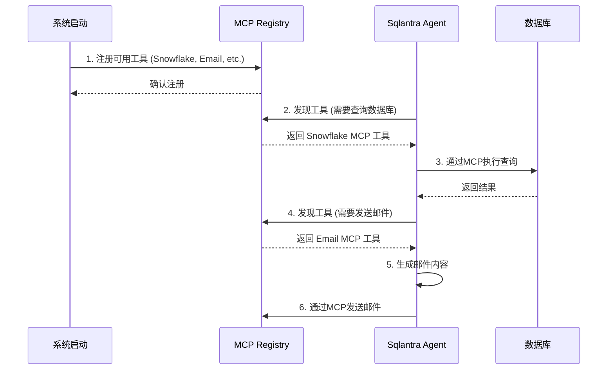

---

## 11. 综合 Demo 流程设计

### 11.1 推荐的 Demo 场景顺序

```mermaid
flowchart TB
    subgraph Phase1["第一阶段: 基础 (5分钟)"]
        P1[系统启动]
        P2[注册MCP工具]
        P3[用户查询演示]
    end
    
    subgraph Phase2["第二阶段: 进阶 (10分钟)"]
        P4[多数据源切换]
        P5[HITL审批流]
        P6[Context Memory]
    end
    
    subgraph Phase3["第三阶段: 高级 (15分钟)"]
        P7[Snowflake集成]
        P8[多Agent协作]
        P9[完整工作流]
    end
    
    P1 --> P2 --> P3
    P3 --> P4 --> P5 --> P6
    P6 --> P7 --> P8 --> P9
```

### 11.2 第一阶段详细脚本

**Step 1: 系统启动**

```
┌─────────────────────────────────────────┐
│  演示: 系统启动 & MCP 工具注册           │
└─────────────────────────────────────────┘

1. 启动 Sqlantra 服务
   $ python3 web_demo.py

2. 观察控制台输出:
   ╔══════════════════════════════════╗
   ║  Sqlantra System V2                  ║
   ║  🌐 http://localhost:8766       ║
   ║                                 ║
   ║  MCP Tools Registered:          ║
   ║  • sqlite_query                ║
   ║  • hitl_approval               ║
   ║  • context_memory              ║
   ╚══════════════════════════════════╝
```

**Step 2: 基础查询演示**

```
┌─────────────────────────────────────────┐
│  演示: 单步执行查询流程                   │
└─────────────────────────────────────────┘

用户输入: "Show all completed orders"

步骤:
[Sqlantra Start] → [Skill Matching] → [Agent Routing] 
  → [Text2SQL] → [Memory Update] → [DB Execute]
  → [Pipeline] → [HITL Check]

每步按空格键继续，高亮当前步骤
```

**Step 3: 数据库面板交互**

- 左下方面板显示所有表
- 选择不同表展示数据
- 实时刷新

### 11.3 第二阶段详细脚本

**Step 4: 数据源切换**

```
用户选择 MySQL 模式:
  → 切换数据库连接
  → 展示 MySQL 特定功能 (事务、JOIN)
  
用户选择 MongoDB 模式:
  → 切换数据库连接
  → 展示文档查询示例
```

**Step 5: HITL 审批流**

```
场景: 查询超过 $50,000 的订单

步骤:
1. 用户查询 "Show orders over $50,000"
2. Sqlantra 检测到高价值交易
3. 暂停，显示 HITL 审批面板
4. 用户点击 "Approve" 或 "Reject"
5. 记录审批结果到 Context Memory
```

### 11.4 第三阶段详细脚本

**Step 6: Snowflake 集成 (需要云账号)**

```
场景: 智能销售分析

1. 配置 Snowflake 连接
2. 注册 Snowflake MCP 工具
3. 用户问: "上季度销售趋势如何?"
4. Sqlantra 调用 Cortex Analyst
5. 生成并执行 SQL
6. 返回分析结果 + 可视化
```

**Step 7: 完整工作流**

```mermaid
sequenceDiagram
    participant U as 用户
    participant Sqlantra as Sqlantra系统
    participant R as MCP Registry
    participant C as Snowflake Cortex
    participant E as Email Service
    
    U->>Sqlantra: "分析库存并自动采购"
    
    Sqlantra->>R: 发现分析工具
    R-->>Sqlantra: 返回工具列表
    
    Sqlantra->>C: 查询库存数据
    C-->>Sqlantra: 库存分析结果
    
    Sqlantra->>C: AI决策: 需要采购
    C-->>Sqlantra: 采购建议
    
    Sqlantra->>U: 显示建议 (等待确认)
    U->>Sqlantra: 确认
    
    Sqlantra->>R: 发现邮件工具
    R-->>Sqlantra: 返回工具
    
    Sqlantra->>E: 发送采购邮件
    E-->>Sqlantra: 发送成功
    
    Sqlantra->>U: 完成!
```

---

## 总结: 推荐实现的 Demo 场景

| 优先级 | 场景 | 复杂度 | 说明 |
|--------|------|--------|------|
| ⭐⭐⭐ | 步骤单步执行 | ⭐ | 当前最需要 |
| ⭐⭐⭐ | 数据库面板增强 | ⭐ | 方便查看数据 |
| ⭐⭐ | HITL 改进 | ⭐⭐ | 更真实的审批场景 |
| ⭐⭐ | MySQL 支持 | ⭐⭐ | 展示SQL能力 |
| ⭐⭐ | Context Memory 增强 | ⭐⭐ | 智能召回 |
| ⭐ | MongoDB 支持 | ⭐⭐ | NoSQL 能力 |
| ⭐⭐⭐ | Snowflake 集成 | ⭐⭐⭐ | 展示 DW 能力 |

---

*文档生成时间: 2026-04-25*
*Sqlantra System V3 Architecture Research*
