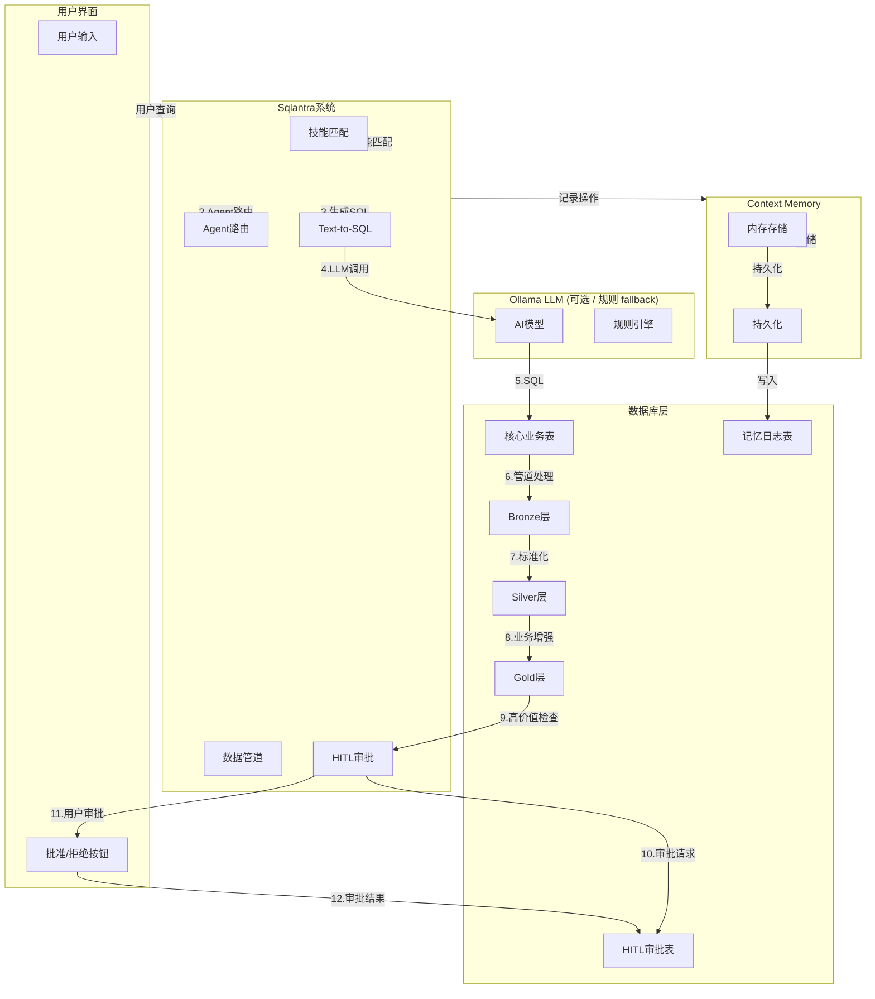
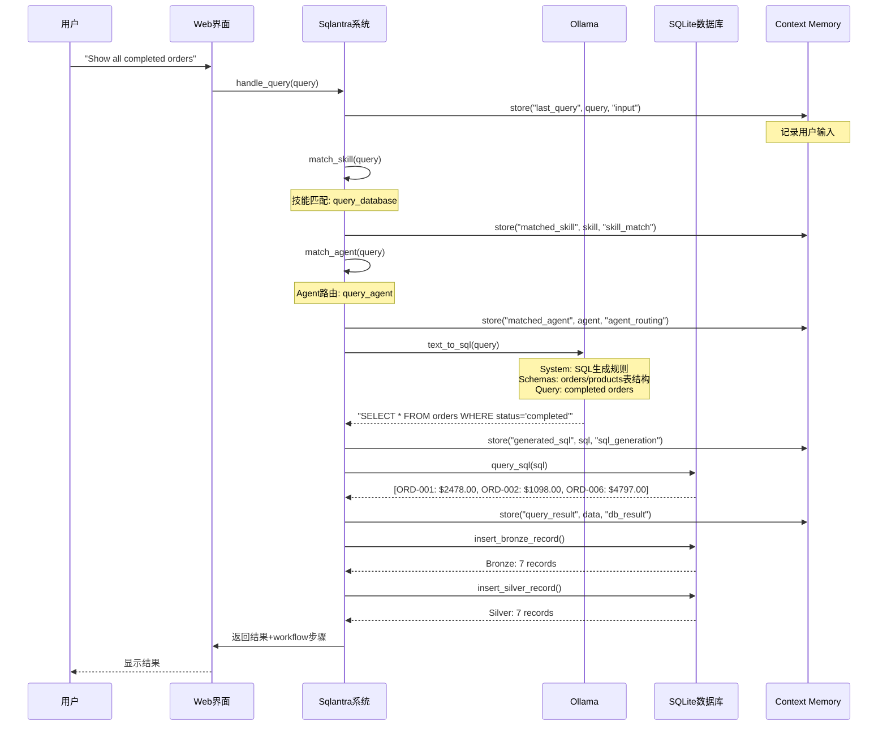
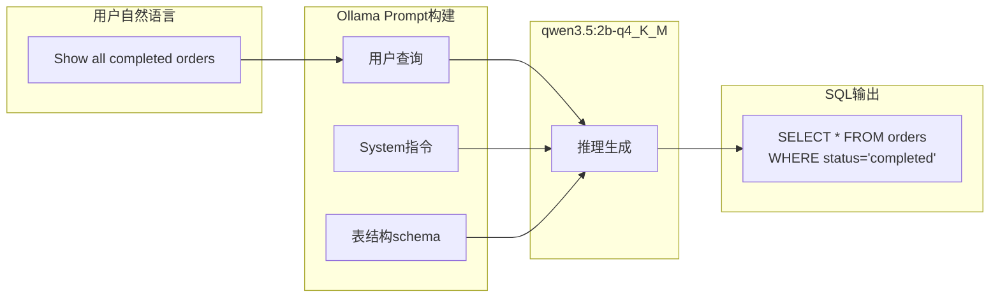
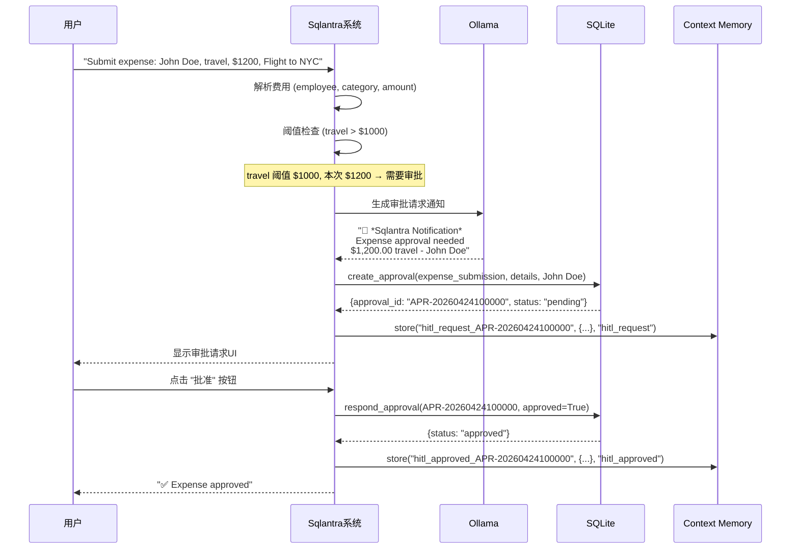
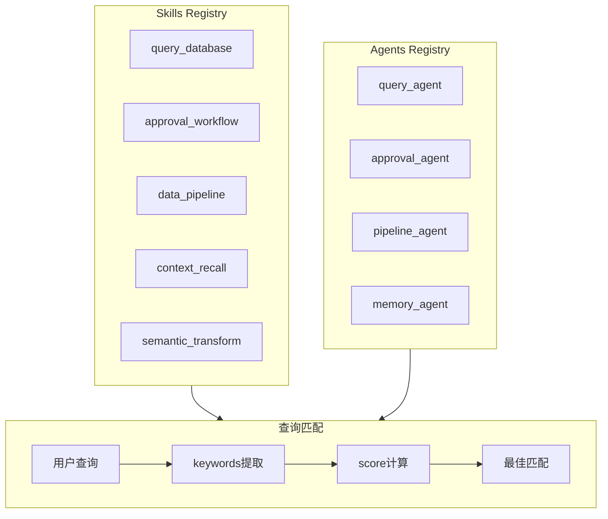
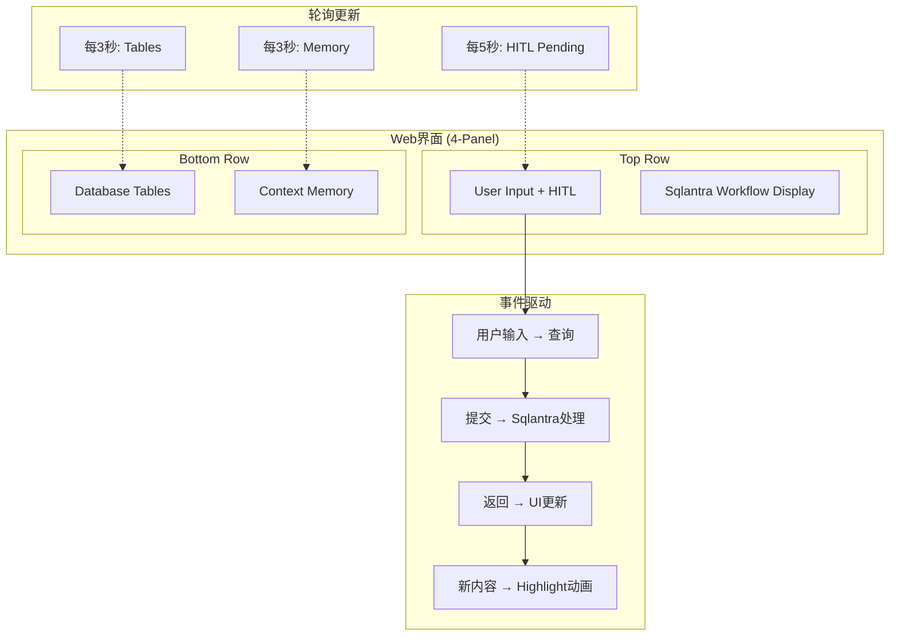

# Sqlantra System V2 完整架构与数据流

## 整体架构图



---

## 详细数据流示例

### 场景1: 用户查询 - 完整流程



**具体数据:**

```
用户输入: "Show all completed orders"

Step 1: 技能匹配
  matched_skill: query_database
  score: 15 (show, list, order, amount关键词)

Step 2: Agent路由
  matched_agent: query_agent
  keywords_matched: ["query", "show", "order", "status"]

Step 3: Text-to-SQL (Ollama调用)
  Prompt: You are a text-to-SQL assistant...
              Tables: orders (order_id, channel, total_amount, status...)
              Query: Show all completed orders
  
  Generated SQL: SELECT * FROM orders WHERE status='completed'

Step 4: 数据库执行
  Result: [
    {order_id: "ORD-001", channel: "Web", total_amount: 2478.0, status: "completed"},
    {order_id: "ORD-002", channel: "App", total_amount: 1098.0, status: "completed"},
    {order_id: "ORD-006", channel: "API", total_amount: 4797.0, status: "completed"}
  ]

Step 5: Pipeline处理
  Bronze: 3 records ingested with _ingested_at, _source
  Silver: 3 records curated with type conversion
```

---

### 场景2: Text-to-SQL 转换 (Ollama集成)



**具体例子:**

```
输入自然语言:
  "Show all completed orders"

Ollama Prompt:
  """
  You are a text-to-SQL assistant. 
  
  Tables:
  - orders (order_id, channel, customer_id, order_date, total_amount, status...)
  - products (product_id, name, category, price, stock...)
  - order_items (item_id, order_id, product_id, quantity, unit_price...)
  - hitl_approvals (approval_id, action_type, details, status...)
  
  Rules:
  1. Only generate SELECT statements
  2. hitl_approvals has NO amount column
  3. Use exact string matches for status
  
  Query: Show all completed orders
  """

Generated SQL:
  SELECT * FROM orders WHERE status = 'completed';

Post-processing (修复hitl_approvals错误):
  如果SQL包含 "hitl_approvals" + "amount"
  → 自动移除amount条件
```

---

### 场景3: Context Memory 记忆存储

```mermaid
flowchart TB
    subgraph WRITE["store 写入"]
        W1[key: "last_query"]
        W2[value: "Show all completed orders..."]
        W3[operation: "input"]
        W4[metadata: {timestamp, caller_file, caller_line}]
    end

    subgraph READ["recall 召回"]
        R1[key: "last_query"]
        R2[value: "Show all completed orders..."]
    end

    subgraph PERSIST["持久化"]
        D1[写入SQLite]
        D2[context_memory_log表]
    end

    W1 --> W2 --> W3 --> W4
    W4 --> D1 --> D2
    R1 --> R2
```

**具体数据:**

```
Context Memory 内存存储:
  {
    "system_start": {
      value: "2026-04-24T10:00:00",
      operation: "system",
      timestamp: "2026-04-24T10:00:00",
      operation_type: "SYSTEM"
    },
    "ollama_model": {
      value: "qwen3.5:2b-q4_K_M",
      operation: "config",
      timestamp: "2026-04-24T10:00:00.001",
      operation_type: "CONFIG"
    },
    "last_query": {
      value: "Show all completed orders",
      operation: "input",
      timestamp: "2026-04-24T10:05:23.123",
      operation_type: "USER_INPUT",
      caller_file: "web_demo.py",
      caller_line: 625
    },
    "matched_skill": {
      value: {name: "Query Database", description: "Execute SQL queries..."},
      operation: "skill_match",
      timestamp: "2026-04-24T10:05:23.125",
      operation_type: "SKILL_MATCH"
    },
    "matched_agent": {
      value: {name: "Query Agent", class: "QueryAgent"},
      operation: "agent_routing",
      timestamp: "2026-04-24T10:05:23.127",
      operation_type: "AGENT_ROUTING"
    },
    "generated_sql": {
      value: "SELECT * FROM orders WHERE status='completed'",
      operation: "sql_generation",
      timestamp: "2026-04-24T10:05:23.200",
      operation_type: "LLM_SQL"
    },
    "query_result": {
      value: [{order_id: "ORD-001", total_amount: 2478.0, status: "completed"}, ...],
      operation: "db_result",
      timestamp: "2026-04-24T10:05:23.500",
      operation_type: "DATABASE"
    }
  }

_operation_history (操作历史):
  [
    {action: "store: system_start", timestamp: "2026-04-24T10:00:00", operation_type: "SYSTEM"},
    {action: "store: ollama_model", timestamp: "2026-04-24T10:00:00", operation_type: "CONFIG"},
    {action: "store: last_query", timestamp: "2026-04-24T10:05:23.123", operation_type: "USER_INPUT"},
    {action: "store: matched_skill", timestamp: "2026-04-24T10:05:23.125", operation_type: "SKILL_MATCH"},
    {action: "store: matched_agent", timestamp: "2026-04-24T10:05:23.127", operation_type: "AGENT_ROUTING"},
    {action: "store: generated_sql", timestamp: "2026-04-24T10:05:23.200", operation_type: "LLM_SQL"},
    {action: "store: query_result", timestamp: "2026-04-24T10:05:23.500", operation_type: "DATABASE"}
  ]
```

---

### 场景4: HITL 费用报销审批流程



**具体数据:**

```
提交费用:
  employee: "John Doe"
  category: "travel"
  amount: 1200.00
  threshold_used: 1000 (travel)
  needs_approval: true

创建审批请求:
  approval_id: "APR-20260424100000"
  action_type: "expense_submission"
  details: {
    employee: "John Doe",
    category: "travel",
    amount: 1200.00,
    description: "Flight to NYC"
  }
  requester: "Sqlantra_System"
  status: "pending"
  notification: "🤖 *Sqlantra Notification*\nExpense approval needed\n$1,200.00 travel - John Doe\nRequested by: Sqlantra_System"
  created_at: "2026-04-24T10:00:00.000"

用户批准:
  approval_id: "APR-20260424100000"
  status: "approved"
  comment: "Approved by user"
  responded_at: "2026-04-24T10:01:30.000"

Context Memory记录:
  {
    key: "hitl_request_APR-20260424100000",
    value: {approval_id: "APR-...", action_type: "expense_submission", status: "pending"},
    operation: "hitl_request",
    timestamp: "2026-04-24T10:00:00.000"
  }
  {
    key: "hitl_approved_APR-20260424100000",
    value: {approval_id: "APR-...", action_type: "expense_submission", result: {...}, approver: "human_user"},
    operation: "hitl_approved",
    timestamp: "2026-04-24T10:01:30.000"
  }
```

---

### 场景5: Data Pipeline Bronze→Silver→Gold

```mermaid
flowchart LR
    subgraph INPUT["用户查询结果"]
        R1[{order_id: "ORD-001", total_amount: "2478.00", status: "completed"}]
    end

    subgraph BRONZE["Bronze Layer (原始数据+元数据)"]
        B1[ingest()]
        B2[order_id: "ORD-001"]
        B3[raw_data: JSON]
        B4[_source: "channel_input"]
        B5[_ingested_at: "2026-04-24T10:00:00"]
    end

    subgraph SILVER["Silver Layer (标准化+类型转换)"]
        S1[curate()]
        S2[order_id: "ORD-001"]
        S3[total_amount: 2478.00  ← 浮点数!]
        S4[status: "completed"]
        S5[_curated_at: "2026-04-24T10:00:01"]
        S6[_domain: "orders"]
    end

    subgraph GOLD["Gold Layer (业务规则+增强)"]
        G1[enrich()]
        G2[order_id: "ORD-001"]
        G3[total_amount: 2478.00]
        G4[customer_segment: "PREMIUM"]
        G5[clv_prediction: 收益预测]
    end

    R1 --> B1 --> B2 & B3 & B4 & B5
    B2 & B3 & B4 & B5 --> S1 --> S2 & S3 & S4 & S5 & S6
    S2 & S3 & S4 & S5 & S6 --> G1 --> G2 & G3 & G4 & G5
```

**具体数据变化:**

```
Step 1: 用户查询原始数据 (Bronze摄入前)
┌─────────────────────────────────────┐
│ order_id: "ORD-001"                │
│ total_amount: "2478.00"  ← 字符串! │
│ channel: "Web"                     │
│ status: "completed"                │
└─────────────────────────────────────┘
              ↓ insert_bronze_record("ORD-001", data)

Step 2: Bronze Layer (加元数据, bronze_orders表)
┌─────────────────────────────────────┐
│ order_id: "ORD-001"                │
│ raw_data: "{...}"  ← 原始JSON       │
│ _source: "channel_input"           │
│ _ingested_at: "2026-04-24T10:00:00"│
└─────────────────────────────────────┘
              ↓ insert_silver_record(data)

Step 3: Silver Layer (标准化, silver_orders表)
┌─────────────────────────────────────┐
│ order_id: "ORD-001"                │
│ channel: "Web"                     │
│ total_amount: 2478.00  ← 浮点数!   │
│ status: "completed"                │
│ _curated_at: "2026-04-24T10:00:01" │
│ _domain: "orders"                  │
└─────────────────────────────────────┘
              ↓ process_gold_metrics()

Step 4: Gold Layer (业务指标聚合)
┌─────────────────────────────────────┐
│ gold_daily_sales:   按日期+渠道聚合  │
│ gold_product_performance: 销量+库存预警│
│ gold_customer_360:  分段+CLV预测     │
└─────────────────────────────────────┘

数据库表记录:
  bronze_orders:
    {order_id: "ORD-001", raw_data: "{...}", _source: "channel_input", _ingested_at: "..."}
  
  silver_orders:
    {order_id: "ORD-001", channel: "Web", total_amount: 2478.00, status: "completed", _curated_at: "...", _domain: "orders"}
  
  gold_daily_sales / gold_product_performance / gold_customer_360:
    由 process_gold_metrics() 从 silver_orders + order_items + products 聚合生成
```

---

### 场景6: Skills 与 Agents 注册匹配



**具体数据:**

```
Skills Registry (技能注册):
  query_database:
    name: "Query Database"
    description: "Execute SQL queries on the database"
    file: "text_to_sql.py"
    function: "execute_text_query"
    category: "database"
  
  approval_workflow:
    name: "HITL Approval Workflow"
    description: "Request human approval for sensitive operations"
    file: "hitl_workflow.py"
    function: "request_approval"
    category: "workflow"

  data_pipeline:
    name: "Data Pipeline"
    description: "Process data through Bronze/Silver/Gold layers"
    file: "data_pipeline.py"
    function: "process"
    category: "pipeline"

Agents Registry (Agent注册):
  query_agent:
    name: "Query Agent"
    description: "Handles database queries and SQL generation"
    skills: ["query_database", "semantic_transform"]
    class: "QueryAgent"
    capabilities: ["text_to_sql", "db_query", "data_analysis"]
  
  approval_agent:
    name: "Approval Agent"
    description: "Manages HITL approval workflows"
    skills: ["approval_workflow"]
    class: "HITLAgent"
    capabilities: ["request_approval", "notify", "workflow_control"]

匹配示例:
  Query: "Show all completed orders"
  
  Skill Matching:
    query_database: score=15 (show=2, order=2, status=2, completed=2 + query/order关键词)
    approval_workflow: score=0
    data_pipeline: score=0
    → 匹配结果: query_database
  
  Agent Matching:
    keywords: ["show", "order", "completed", "status"]
    query_agent: matched (query, show, order)
    → 匹配结果: query_agent
```

---

### 场景7: Web界面 4-Panel 实时更新



**UI 数据流:**

```
Panel 1: User Input + HITL
  输入框: "Show all completed orders"
  发送按钮 → /api/query POST
  结果显示: 表格 + SQL
  HITL按钮: Approve/Reject (当有pending审批时显示)

Panel 2: Sqlantra Workflow Display
  Step 1: Skill Matching
    detail: "Matched skill: Query Database"
    code: "Skill: text_to_sql.py::execute_text_query"
  
  Step 2: Agent Routing
    detail: "Selected agent: Query Agent"
    code: "Agent: QueryAgent in context_memory.py"
  
  Step 3: Text-to-SQL Generation
    detail: "Generated SQL query"
    code: "SELECT * FROM orders WHERE status='completed'"
  
  Step 4: Context Memory Update
    detail: "Storing query context for future recall..."
  
  Step 5: Database Execution
    detail: "Retrieved 3 rows"
    code: "✓ 3 rows"
  
  Step 6: Pipeline Processing
    detail: "Processing 3 records through Bronze→Silver→Gold..."

Panel 3: Database Tables
  表选择器: orders, products, order_items, bronze_orders...
  状态栏: DB Connected | Ollama: qwen3.5:2b-q4_K_M | Tables: 11
  数据表格: 列名 + 行数据

Panel 4: Context Memory
  显示条目: (key, operation_type, value, timestamp)
  每条包含:
    - key: "last_query", "matched_skill", "generated_sql"...
    - operation_type: "USER_INPUT", "SKILL_MATCH", "LLM_SQL"...
    - value: (截断显示)
    - timestamp: ISO格式时间

Highlight动画:
  新内容出现时:
    - 背景: rgba(255, 212, 59, 0.3) (半透明金色)
    - 左边框: 3px solid var(--gold)
    - 3秒后自动淡出
```

---

## 模块关系总览表

| 模块 | 输入 | 输出 | 作用 | 关键类/函数 |
|------|------|------|------|-------------|
| **sqlantra_database_v2.py** | | | | |
| init_database() | - | DB表 | 创建11个表+样本数据 | |
| query_sql() | SQL字符串 | 查询结果 | 执行SQL | sqlite3 |
| insert_bronze_record() | order_id, raw_data | Bronze表 | 数据摄入 | JSON存储 |
| insert_silver_record() | order_data | Silver表 | 数据标准化 | 类型转换 |
| process_gold_metrics() | - | Gold表 | 业务聚合 | 分段+CLV预测 |
| create_approval() | action, details | 审批记录 | 创建审批请求 | |
| respond_approval() | approval_id, approved | 审批更新 | 处理审批响应 | |
| **text_to_sql.py** | | | | |
| call_ollama() | prompt | LLM响应 | 调用Ollama | urllib.request |
| text_to_sql() | 自然语言 | SQL语句 | NL转SQL | post-process修复 |
| execute_text_query() | NL查询 | 完整结果 | 查询+执行 | |
| **context_memory.py** | | | | |
| SqlantraContextMemory.store() | key, value, op | MemoryEntry | 存储记忆 | thread-safe |
| SqlantraContextMemory.recall() | key | value | 召回记忆 | 记录访问 |
| log_ollama_call() | prompt, response | 日志 | 记录LLM调用 | |
| SkillsRegistry.match_skill() | query | Skill | 技能匹配 | 关键词评分 |
| AgentsRegistry.match_agent() | query | Agent | Agent路由 | 关键词匹配 |
| **hitl_workflow.py** | | | | |
| request_approval() | action, details | 审批请求 | 创建审批 | Ollama生成通知 |
| approve() | approval_id | 批准结果 | 处理批准 | 执行handler |
| reject() | approval_id | 拒绝结果 | 处理拒绝 | |
| **web_demo.py** | | | | |
| SqlantraDemoHandler | - | HTTP响应 | 请求处理 | HTTPServer |
| handle_query() | query | workflow+data | 完整查询流程 |  orchestrate |

---

## 数据库表总览

```
核心业务表:
  ┌─────────────────┬──────────────────────────────────────────┐
  │ orders          │ order_id, channel, total_amount, status │
  │ products        │ product_id, name, category, price, stock│
  │ order_items     │ order_id, product_id, quantity, price   │
  └─────────────────┴──────────────────────────────────────────┘

Pipeline层:
  ┌──────────────────────┬──────────────────────────────────┐
  │ bronze_orders        │ _source, _ingested_at (元数据)  │
  │ silver_orders        │ _curated_at, _domain (标准化)   │
  │ gold_daily_sales     │ 按日期+渠道聚合 (业务指标)       │
  │ gold_product_performance │ 销量+库存预警 (业务指标)    │
  │ gold_customer_360    │ 客户分段+CLV预测 (业务指标)     │
  └──────────────────────┴──────────────────────────────────┘

系统表:
  ┌───────────────────┬────────────────────────────────────┐
  │ hitl_approvals   │ approval_id, action_type, status │
  │ context_memory_log│ memory_key, operation, metadata    │
  └───────────────────┴────────────────────────────────────┘
```

---

## Ollama 配置与调用

```
URL: http://localhost:11434/api/generate
Model: qwen3.5:2b-q4_K_M

请求格式:
{
  "model": "qwen3.5:2b-q4_K_M",
  "prompt": "...",
  "stream": false,
  "options": {
    "temperature": 0.1,    // Text-to-SQL: 低温度,确定性
    "num_predict": 512
  }
}

应用场景:
  1. Text-to-SQL生成 (temperature: 0.1)
  2. HITL通知生成 (temperature: 0.3, 稍创意)
  3. SQL解释生成 (temperature: 0.1)
```

---

## 启动与运行

```bash
# 1. 环境准备
cd /path/to/Sqlantra-local-ollama_mysql_v2_1
source /path/to/sqlantra_env/bin/activate

# 2. 启动Ollama (另一个终端)
ollama serve
ollama pull qwen3.5:2b-q4_K_M

# 3. 启动Sqlantra系统
python3 web_demo.py

# 4. 访问Web界面
# 浏览器打开: http://localhost:8766
```

---

## API端点

| 端点 | 方法 | 说明 |
|------|------|------|
| `/` | GET | 主界面HTML |
| `/api/tables` | GET | 获取所有表名 |
| `/api/table/{name}` | GET | 获取表数据 |
| `/api/memory` | GET | 获取记忆条目 |
| `/api/hitl/pending` | GET | 获取待审批 |
| `/api/query` | POST | 执行查询 |
| `/api/hitl/respond` | POST | 审批响应 |
| `/api/reset` | POST | 重置系统 |

---

*本文档基于Sqlantra System V2生成，详细实现请参考源代码和COMPREHENSIVE_DOCUMENTATION.md*
